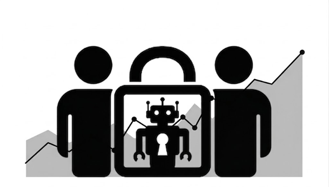

# Spec-Lock-Diff

**English** · [Português (pt-BR)](README.pt-br.md)

<p align="center">
  
</p>

A framework for dbt development using AI agents. The goal is to reduce the risks that arise when an agent writes SQL: i. wrong results that look right, ii. leakage of personal data, and iii. unexpected financial costs.

The framework boils down to three phases:

- **Spec** — The human defines, in structured detail, what the dbt model should do _before_ any code is written.
- **Lock** — Deterministic restrictions. Cost, access, and behavior limits live in the infrastructure (warehouse, CI, permissions), not in text instructions to the agent.
- **Diff** — After the agent finishes, the human checks and reviews _numbers_ (differences between production and the new version), not code.

---

## Table of Contents

0. [Roles — who does what](#0-roles--who-does-what)
1. [Manifesto — 3 principles](#1-manifesto--3-principles)
2. [Initial setup — 5 mandatory controls](#2-initial-setup--5-mandatory-controls)
3. [Flow of each PR — 5 stages](#3-flow-of-each-pr--5-stages)
4. [After the merge](#4-after-the-merge)

---

## 0. Roles — who does what

This framework defines four roles. Each person takes on one role per PR.

| Role         | Who they are             | What they do                                                                                |
| ------------ | ------------------------ | ------------------------------------------------------------------------------------------- |
| **Platform** | Infra/platform team      | Configures the 5 Setup controls (section 2) one time. Does the weekly maintenance (section 4). |
| **Author**   | A human on the team      | Writes the model spec. Triggers the agent. Reads the diff. Is responsible for the PR.       |
| **Partner**  | Another human (≠ Author) | Approves PRs of critical models.                                                            |
| **Agent**    | The AI (LLM + tools)     | Writes code, tests, and the numerical pre-registration.                                     |

---

## 1. Manifesto — 3 principles

 _Why_ the framework is being built. All rules derive from them.

### Principle 1: In SQL, a bug doesn't give an error — it gives a plausible (wrong) number

When you get a `JOIN` wrong in Python, the program usually breaks. When you get a `JOIN` wrong in SQL, it's common for the query to run normally and return a number that seems reasonable but is actually wrong.

That's why the human decides _before_ (by writing the spec) and checks _after_ (by reading the numerical diff). The human does nothing between those two moments — the agent works alone in the middle.

### Principle 2: Limits must be configured in the infrastructure

Writing "do not access sensitive data" in an `AGENTS.md` file does not prevent the agent from accessing sensitive data. That is an instruction, not a control. The agent can ignore it, forget it, or interpret it differently.

Real control requires denying permissions in the database, a resource monitor that shuts down the warehouse, a branch protection that prevents pushing to `main`. If the agent tries to violate, the system blocks — regardless of what the prompt says.

### Principle 3: Checks must be deterministic

It's fine for the agent to be unpredictable when generating code — LLMs are stochastic by nature. But every verification gate (tests, diffs, reconciliations) must be deterministic. The same input should always produce the same result.

An LLM should not be the final judge of "is the code correct?". The judges are automated tests, numerical diffs, and human eyes.

---

## 2. Initial setup — 5 mandatory controls

**Who executes:** Platform. **When:** One time only, before the first PR with an agent. **Rule:** No PR with an agent can run before all 5 controls are implemented.

---

### Control 1: Create a dedicated identity for the agent

**What it is:** The agent must have its own separate identity in the warehouse and in git, with restricted permissions.

**Why it exists:** If the agent uses a human's credentials, it inherits all of that human's permissions. If it runs as admin, it can do anything. A separate identity with minimal permissions limits what the agent can do.

**How to implement:**

In the warehouse (Snowflake, BigQuery or Databricks):

- Create a role called `agent_ci` (or equivalent name).
- Create a user associated with that role.
- This user will have the permissions defined in controls 2, 3, and 4.

In git (GitHub, GitLab etc.):

- Create a bot user for the agent.
- This user **cannot** approve PRs.
- This user **cannot** merge.
- This user **cannot** push directly to `main`.

Branch protection on `main` (all mandatory):

- PR mandatory for any change.
- CODEOWNERS review mandatory.
- Approvals automatically dismissed on each new push (so the agent cannot "pass" an old approval after changing the code).
- No bypass for anyone — including admins.
- Mandatory status checks: CI (stage D) and Diff (stage E) of the per-PR flow.

---

### Control 2: Restricted data access

**What it is:** The agent only sees what it needs to see, and never sees sensitive data.

**Why it exists:** An LLM that accesses raw data can leak personal information (CPF, email, address) in code, tests, PR comments, or even in the conversation log with the model provider.

**How to implement:**

| Data layer                 | Agent permission                                                                                                                                               |
| -------------------------- | -------------------------------------------------------------------------------------------------------------------------------------------------------------- |
| `raw` (raw data)           | **No access.** Not even `SELECT` or `DESCRIBE`.                                                                                                               |
| Staging and production marts | **Read with masking.** Sensitive columns are masked (see below).                                                                                               |
| Production (write)         | **Prohibited.** The agent's `profiles.yml` has no `prod` target. It cannot write to production even if it tries.                                              |
| Working schema             | **Read and write** in an exclusive schema: `ci_pr_<PR_number>`. Created when the PR opens, dropped automatically when the PR closes (merge or abandonment). |

Masking of sensitive columns:

- In the `.yml` of each dbt model, every sensitive column must have `meta: {sensitive: true}`, or an analogous mechanism.
- Masking is applied automatically by the `agent_ci` role when querying these columns.
- Implementation by platform:
    - **Snowflake:** use the `dbt-snow-mask` package.
    - **BigQuery:** use policy tags.
    - **Databricks:** use column masks.

---

### Control 3: Spending caps

**What it is:** Financial limits that automatically shut down the agent when reached.

**Why it exists:** An agent can generate expensive queries in a loop (accidental cross joins, repeated full scans, infinite loops).

**How to implement:**

Warehouse costs:

- **Snowflake:** Resource monitor with `FREQUENCY = DAILY` and action `SUSPEND_IMMEDIATE`. The daily quota should be: (monthly quota ÷ 22 business days). When reached, the warehouse is shut down immediately.
- **BigQuery:** Daily quota of scanned bytes in the agent's CI project.
- **Databricks:** Databricks' budget system only sends alerts (doesn't shut down). So create a job that runs every hour, queries the day's accumulated consumption, and shuts down the agent's SQL warehouse if it's above the cap.

Timeout per query:

- Configure `STATEMENT_TIMEOUT_IN_SECONDS` on the agent's user and warehouse. If a query takes longer than the timeout, it is cancelled automatically.

---

### Control 4: Aggregate statistics instead of access to real records

**What it is:** Instead of allowing the agent to query real rows of data, provide it with a pre-computed statistical summary of each model.

**Why it exists:** If the agent runs `SELECT * FROM customers`, it sees names, emails, CPFs — real data. Even with masking, the less the agent sees, the better. A statistical profile gives the agent enough information to write correct SQL, without exposing any individual data.

**How to implement:**

Create a weekly job that:

1. Runs with the `agent_ci` role.
2. For each dbt model, generates a file in `docs/profile/<model_name>.yml`.
3. Each file contains, per column:
    - Total row count.
    - Percentage of nulls.
    - Cardinality (number of distinct values).
    - Top 20 values **only** in columns marked with `meta: {categorical: true}` in the model's `.yml`. Columns without this tag do not display individual values.
4. The profile **does not contain**: minimum values, maximum values, data samples, row examples.

When the agent needs to understand the structure of data, it consults `docs/profile/`. It never runs exploratory queries in the warehouse.

---

### Control 5: Protected paths and anti-fraud gates

**What it is:** Certain files and directories must be protected so that only humans can modify them. Additionally, a CI script must detect if the agent tried to weaken tests or bypass protections.

**Why it exists:** An agent can, without ill intent, remove a failing test, change the expected result of a test to make it pass, or change a security config. These changes make the CI green, but hide bugs. Humans need to control the files that define the rules of the game.

**How to implement:**

**Part A — CODEOWNERS (git requires human approval for these paths):**

| Protected path                              | Why it is protected                                                                                                          |
| ------------------------------------------- | ---------------------------------------------------------------------------------------------------------------------------- |
| `.github/`                                  | CI workflows. If the agent changes the CI, it controls the rules.                                                           |
| `.pre-commit-config.yaml`                   | Local validation hooks.                                                                                                     |
| `CODEOWNERS`                                | The file that defines who approves what.                                                                                    |
| `AGENTS.md`                                 | The agent's rules.                                                                                                          |
| `packages.yml`                              | dbt dependencies. An agent could pin a vulnerable version.                                                                  |
| `dbt_project.yml`                           | Global project configuration.                                                                                               |
| `macros/`                                   | Macros are reused by several models. One change affects everything.                                                         |
| `tests/`                                    | Generic tests.                                                                                                              |
| `analyses/reconciliation_*`                 | Reconciliation queries. If the agent changes the reconciliation in the same PR as the model, it controls what is being verified. |
| `models/semantic/`                          | Metric definitions. A wrong metric propagates errors to all consumers.                                                      |
| `docs/profile/`                             | Statistical profiles. If the agent changes the profile, it changes its own reference.                                       |
| Incremental models (list explicitly)        | Incremental models are more complex and fragile.                                                                            |
| Critical model directories                  | The CODEOWNERS owner should be the domain's data owner.                                                                     |

**Part B — Anti-fraud gate:**

A script that runs in CI on the commits made by the bot. It is the only custom script that the framework requires. It analyzes the bot's diffs and **blocks the PR** if it finds any of these situations:

| Detected situation                                      | Why it blocks                                                                                                  |
| ------------------------------------------------------- | -------------------------------------------------------------------------------------------------------------- |
| Test removed                                            | An agent can remove a failing test instead of fixing the code.                                                 |
| `WHERE` or exclusion clause added to a test             | A way to make a test pass without fixing the problem: filter out failing cases.                                |
| `severity` downgraded (e.g., `error` → `warn`)          | Turning an error into a warning makes CI pass, but the problem remains.                                        |
| `expect` value changed in an existing test              | If the agent changes the expected result, any result becomes "correct".                                        |
| `analyses/reconciliation_*` changed in the same PR as the model | The agent cannot change the model AND the reconciliation that verifies the model in the same PR. It would be like a student writing the exam and the answer key. |
| Package pin changed                                     | Changing dependency versions can introduce different behaviors.                                                |

**Optional (extra layer of protection):** If the agent supports hooks before executing tools (e.g., `PreToolUse` in Claude Code), configure a hook that refuses writing to protected paths on the spot — even before the commit.

---

## 3. Flow of each PR — 5 stages

Every PR follows these 5 stages in order. Each stage has an owner and a blocking condition.

| Stage | Name                  | Who executes                  | What blocks progress                                                                             |
| ----- | --------------------- | ----------------------------- | ------------------------------------------------------------------------------------------------ |
| **A** | Spec                  | Author (human)                | PR cannot advance without a completed spec. Critical models also require a reconciliation query. |
| **B** | Pre-registration      | Agent                         | —                                                                                                |
| **C** | Code                  | Agent                         | Cannot start without a valid pre-registration.                                                   |
| **D** | Automatic CI          | Automation (on every push)    | Any failure blocks. Maximum time: ~15 minutes.                                                   |
| **E** | Diff + human review   | Automation + Author + Partner | Diff outside pre-registration blocks. Reconciliation outside tolerance blocks.                  |

---

### Stage A: Spec (Author)

**What it is:** The Author (human) writes a declarative specification in the model's `.yml`, inside the `meta.spec` block. The spec defines _what the model should do_ — not _how_.

**Where it lives:** In the dbt model's `.yml` file, inside `meta.spec`.

**When it is mandatory:** In all models within `models/marts/**`. Models in staging or intermediate can have a spec, but it is not mandatory.

**Spec fields (6 base fields + 3 additional for critical models):**

```yaml
meta:
  spec:
    # --- 6 mandatory fields for every model in marts/ ---

    grain: "one row per order per day"
    # What each row represents. This is the most important definition of the model.
    # Example: "one row per customer" or "one row per transaction per product".

    primary_key: [order_id, date_day]
    # The columns that together uniquely identify a row.
    # The agent will generate a uniqueness test for this combination.

    tier: critical  # Possible values: "critical" or "standard"
    # "critical" = model that feeds business decisions, financial reports
    #             or executive dashboards. Requires 3 extra fields (below)
    #             and approval from a Partner.
    # "standard" = everything else.

    metrics:
      gross_revenue: "sum of order_total before discounts and taxes"
    # Each metric the model calculates, with a natural language definition.
    # The agent will use these definitions to write the SQL.
    # The diff (stage E) will compare the values of these metrics between
    # production and the new version.

    known_edges:
      - "status='cancelled' → row excluded"
      - "value in cents → divide by 100"
      - "timestamp in UTC → convert to America/Sao_Paulo"
    # Special cases the Author already knows exist.
    # EACH edge becomes a unit test with synthetic fixture.
    # The edge should describe the EXPECTED result, not the implementation.
    # Good example: "status='cancelled' → row excluded"
    # Bad example: "use WHERE status != 'cancelled'"

    sensitive_columns: [customer_email]
    # List of columns containing personal data.
    # Control 2 masking will be applied to these columns.

    # --- 3 additional fields, mandatory ONLY for tier: critical ---

    reconciliation_query: analyses/recon_fct_orders.sql
    # Path to a SQL query that compares the model result with an
    # external source of truth (another system, closing spreadsheet, etc.).
    # This query runs in stage E with full data.

    reconciliation_tolerance: "0.1%"
    # The maximum acceptable difference between the model and the source of truth.
    # If the difference is greater than this, the PR is blocked.

    external_validation: "gross_revenue 2025-12 = R$ 14,203,118.40 in accounting closing"
    # A concrete number from outside the warehouse that serves as an anchor.
    # This exists because the spec can also be wrong.
    # If the spec is wrong, all tests will pass (they test the spec),
    # but the final result will diverge from the real number.
    # External validation catches that case.
```

**Important rules about the spec:**

1. The agent can draft an initial version of the spec from the statistical profile (Control 4). But the 6 fields must be read and approved by the human **before** any line of code is written.

2. The spec can also be wrong. An error in the spec is invisible to all automated gates (because the tests verify the spec, not reality). That's exactly why the `external_validation` field exists: it anchors the model to a number that comes from outside the warehouse.

---

### Stage B: Pre-registration (Agent)

**What it is:** Before writing any code, the agent declares which numerical changes it _expects_ to happen. This is done in a `pre_registration` block in the model's `.yml`.

**Why it exists:** Without pre-registration, the agent sees the diff numbers and then invents a justification. Pre-registration reverses this order: the agent commits to intervals _before_ seeing the results. If the numbers fall outside the interval, the PR is automatically blocked — the agent cannot "adjust" its prediction later.

The pre-registration is immutable from the moment stage D (CI) begins. If the agent changes the pre-registration after CI has run, the CI is re-executed from scratch and a change counter is incremented in the PR (visible to the Author in review).

**Pre-registration format:**

```yaml
pre_registration:
  type: data_change
  # Possible values:
  #   "data_change" — the change must alter numerical results.
  #   "refactoring" — the change must NOT alter any result.
  #                   If type is "refactoring", every delta MUST be 0.
  #                   Any numerical difference blocks the PR.

  reason: "include status='partially_shipped', previously excluded incorrectly"
  # One-sentence explanation of why the numbers will change.
  # The Author will read this in review and assess whether the interval makes sense
  # given the declared reason.

  row_delta: {min: 0, max: 12000}
  # How many more (or fewer) rows the model will have compared to production.
  # RULE: every interval must have min AND max. Open interval
  # (e.g., {min: 0} without max) is invalid and rejected by CI.

  removed_pks: {max: 0}
  # How many primary keys (rows identified by the spec's PK)
  # exist in production but not in the new version.
  # max: 0 means "no row should disappear".

  altered_columns: [gross_revenue, order_count]
  # Exact list of columns whose values will change.
  # If in the diff a column NOT in this list shows a difference,
  # the PR is blocked. This prevents accidental changes in columns
  # the agent didn't intend to alter.

  metrics:
    gross_revenue: {delta_pct: {min: 0.0, max: 0.8}}
    # For each metric in the spec, the expected percentage range of variation.
    # Example: gross_revenue should increase between 0% and 0.8%.
    # If the actual variation is -1% or +2%, the PR is blocked.
```

**Validation:** The pre-registration is validated by JSON Schema in CI (stage D). If the format is wrong, fields are missing, or intervals are open, CI fails.

---

### Stage C: Code (Agent)

**What it is:** The agent writes the SQL code, tests, and everything needed to implement the spec. It follows 8 rules, documented in the `AGENTS.md` file (which is protected by Control 5 — only humans can modify it).

**The 8 agent rules:**

Each rule below must have an infrastructure mechanism that enforces it. The text rule exists only for the agent to understand the intention; the mechanism exists so that the rule works even if the agent ignores it.

| #   | Rule                                                                                                                                                                                                                                                                     | Mechanism that enforces                                                                                         |
| --- | ------------------------------------------------------------------------------------------------------------------------------------------------------------------------------------------------------------------------------------------------------------------------ | --------------------------------------------------------------------------------------------------------------- |
| 1   | **No spec, stop and ask.** If the model has no spec, the agent does not start. It asks the Author to write it.                                                                                                                                                           | CI validates spec presence (JSON Schema).                                                                       |
| 2   | **Every model has PK test and minimum count.** The agent creates a uniqueness test on the spec's primary_key and a minimum row count test. Each spec edge becomes a unit test with synthetic fixture (invented data representing the described case).                    | CI validates test presence (JSON Schema + anti-fraud gate).                                                     |
| 3   | **Test failed = code wrong.** If a test fails, the agent fixes the code. Never the opposite. The agent never weakens a test, changes an `expect`, modifies a test macro, or removes a reconciliation to make CI pass.                                                  | Anti-fraud gate (Control 5B) detects and blocks.                                                                |
| 4   | **Metrics live in `models/semantic/`.** Metrics are defined once, in the semantic directory. If the metric the agent needs doesn't exist, it stops and asks the Author to create it.                                                                                    | CODEOWNERS protects `models/semantic/`.                                                                          |
| 5   | **Fixed execution order.** The agent follows this sequence: `dbt compile` → `dbt test --select test_type:unit` → `dbt build`. If the same command fails 3 times in a row, the agent stops and calls a human.                                                           | 3-failure rule in the API gateway.                                                                              |
| 6   | **Pre-registration before diff.** The agent must deliver the pre-registration (stage B) before any diff. Open intervals (without min or max) are invalid.                                                                                                               | JSON Schema in CI.                                                                                              |
| 7   | **Never read individual rows.** The agent does not run `dbt show`, does not do `SELECT` without aggregation, and never pastes a value read from the warehouse into code, test, fixture, or PR comment. Fixtures are always synthetic (invented by the agent).           | `agent_ci` role without access to `raw`. Masking in staging/marts. Anti-fraud gate detects real data in fixtures. |
| 8   | **Do not edit protected paths.** If the task requires changing a protected file (macros, CI, generic tests, etc.), the agent stops and asks the Author.                                                                                                                 | CODEOWNERS blocks merge without human approval.                                                                  |

---

### Stage D: Automatic CI (on every push)

**What it is:** A CI pipeline that runs automatically every time the agent pushes to the PR branch. Must complete in less than 15 minutes.

**What runs (in this order):**

```bash
# 1. Static validations (pre-commit hooks)
pre-commit run --all-files
```

Pre-commit runs:

- **JSON Schema:** validates that the spec, the `sensitive` field, the pre-registration, and mandatory tests exist and are in the correct format.
- **Gitleaks:** detects leaked secrets, including custom rules for email and CPF.
- **Anti-fraud gate:** the Control 5B script runs on the bot's commits.

```bash
# 2. Build with sample
dbt build --select state:modified+ --defer --state ./prod-artifacts --sample "30 days"
```

The build includes:

- **Fusion in `static_analysis: baseline`** — detects non-existent columns and wrong types before running any query (static SQL analysis).
- **Unit tests** generated from the spec's edges.
- **Uniqueness test** of the spec's primary_key.
- **Minimum count test** — the threshold is adjusted proportionally to the sample window (e.g., if the sample is 30 days and the table has 365 days, the minimum threshold is 30/365 of the full threshold).
- **Contracts** on marts models (ensure columns and types are correct).
- **dbt-project-evaluator** — detects structural problems in the project.

**Why run hooks in CI if they already run locally:** Because `git commit --no-verify` skips all local hooks. If someone (or the agent) uses that flag, the hooks don't run. CI ensures that validation happens anyway.

---

### Stage E: Diff + human review (once per PR)

**What it is:** A full `dbt build` (without sample) followed by a numerical diff between the new version and current production. Runs once per PR, when the PR is marked as ready-for-review.

**What runs (in this order):**

**Step 1 — Build with full data**

The build runs in a separate schema called `ci_pr_<n>_full`:

```bash
# For standard models: builds only the modified model
dbt build --select state:modified --defer --state ./prod-artifacts

# For critical models: builds the modified model AND all models that depend on it (downstream), using the "+" operator
dbt build --select state:modified+ --defer --state ./prod-artifacts
```

Why critical models use `state:modified+` (with the `+`): Without the `+`, downstream models would be built on top of **production** intermediate data (via `--defer`), not on the modified version. The diff would show differences only in the modified model, not in the marts that consume it. With the `+`, the entire downstream chain is rebuilt, and the diff captures the full effect of the change.

**Step 2 — Aggregate data diff**

Using Recce or `dbt-audit-helper` in summary mode (never in mode that shows individual rows of sensitive columns):

- The diff is calculated over a **closed `event_time` window**, identical on both sides (production and new version). This is essential: if production has data up to yesterday and the new version has data up to today, the "today" rows would appear as false differences.
- The diff publishes: row count, removed PKs, columns with altered values, and the value of each metric defined in the spec.

**Step 3 — Comparison with the pre-registration**

Each diff number is automatically compared with the intervals declared in the pre-registration (stage B). The PR is **blocked** if any of these conditions is true:

- A number is outside the declared interval (e.g., row delta is 15,000, but the pre-registration said `max: 12000`).
- A column shows a difference but is not in the pre-registration's `altered_columns` list.
- The type is `refactoring` but some delta is not zero.

**Step 4 — Reconciliation (critical models only)**

For models with `tier: critical`, the reconciliation query (`reconciliation_query`) runs on full data and compares the result with the declared tolerance (`reconciliation_tolerance`). If the difference is greater than the tolerance, the PR is **blocked**.

This is the only gate capable of detecting the case where the AI incorrectly assumed the meaning of a column. If the agent thinks `order_total` is gross but it's actually net, the unit tests pass (they test what the spec says), but the reconciliation against the accounting system fails.

**Step 5 — Human review: three readings**

The Author (and the Partner, if the model is critical) reads exactly three things.

| # | Question                                                | What I'm looking for                                                                                                     |
| - | ------------------------------------------------------- | ------------------------------------------------------------------------------------------------------------------------ |
| 1 | Is the spec's grain the desired grain?                  | Verify whether the definition of "one row" makes sense for the business.                                               |
| 2 | Is the pre-registration narrow enough to be able to fail? Does the reason justify the interval? | A pre-registration that says `row_delta: {min: -999999, max: 999999}` is useless — it never fails. The interval should be tight enough to catch real errors. |
| 3 | Do the unit test `expect`s say the same as the spec's edges? | Verify whether the agent translated the spec's edges correctly into tests.                                              |

**Approval rules:**

- **Standard** model: the Author approves.
- **Critical** model: a Partner (≠ Author) approves. CODEOWNERS enforces this.
- Macros, incremental models, and `models/semantic/`: always go through human approval, regardless of tier. CODEOWNERS enforces.

---

## 4. After the merge

Once the PR is merged, two automatic processes keep the model correct in production.

| What                                                                       | When it runs | Why                                                                                     |
| -------------------------------------------------------------------------- | ------------ | ----------------------------------------------------------------------------------------- |
| Full-refresh vs. incremental in a parallel environment (critical models)   | Weekly       | Compares a full rebuild with the incremental result. Detects accumulated drift.          |
| Regeneration of `docs/profile/`                                            | Weekly       | Keeps the statistical profiles (Control 4) up to date.                                   |

Other data hygiene processes (freshness, anomaly detection, quality alerts) continue to exist normally. They are not specific to development with agents and are outside the scope of this framework.
