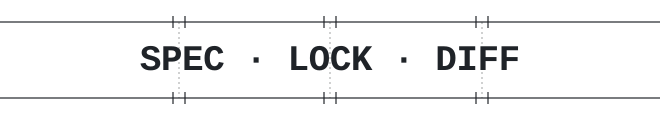
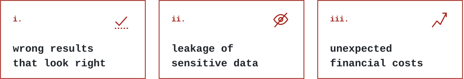
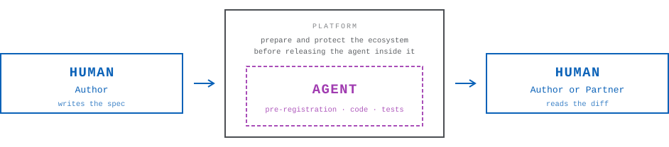
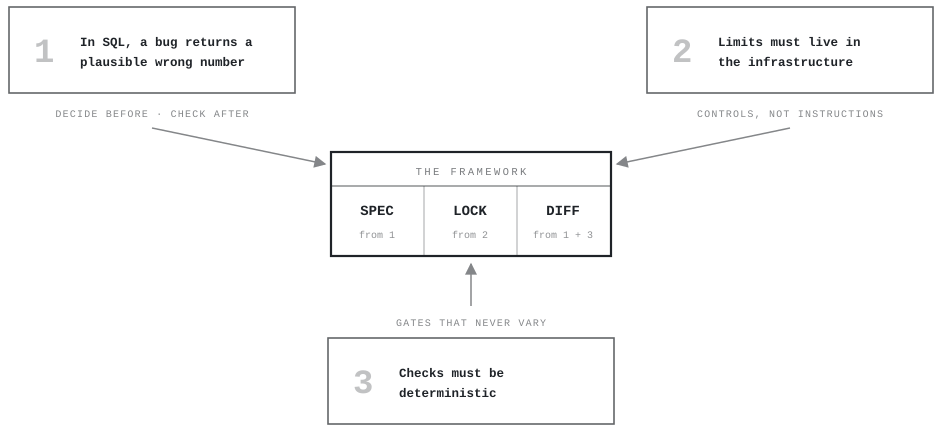
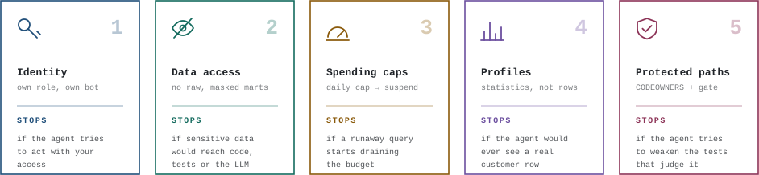
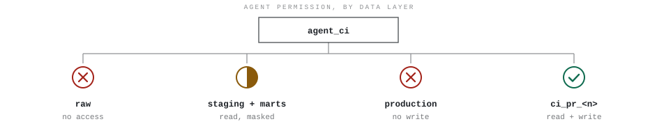
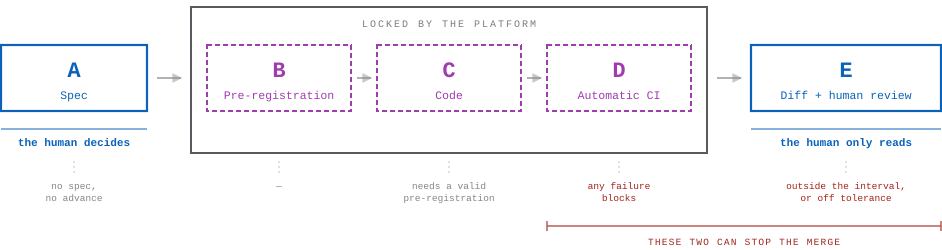
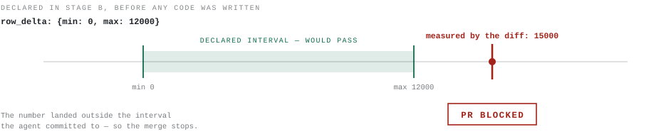
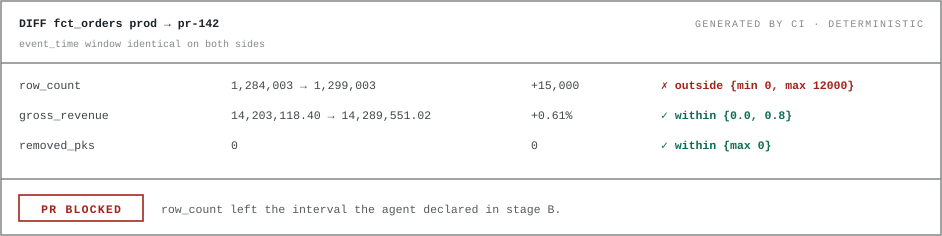

# Spec-Lock-Diff

**English** · [Português (pt-BR)](README.pt-br.md)

<p align="center">
  <picture>
    <source media="(prefers-color-scheme: dark)" srcset="assets/wordmark-dark.svg">
    
  </picture>
</p>

<p align="center">
  
  
  <a href="LICENSE"></a>
  <a href="CONTRIBUTING.md"></a>
  
</p>

A framework for dbt development using AI agents. The goal is to reduce the main risks that arise when an agent writes SQL:

<p align="center">
  <picture>
    <source media="(prefers-color-scheme: dark)" srcset="assets/risks-en-dark.svg">
    
  </picture>
</p>

The framework boils down to three phases:

- **Spec** — The human defines, in structured detail, what the dbt model should do _before_ any code is written.
- **Lock** — Deterministic restrictions. Cost, access, and behavior limits live in the infrastructure (warehouse, CI, permissions), not in text instructions to the agent.
- **Diff** — After the agent finishes, the human checks and reviews _numbers_ (differences between production and the new version), not code.

A working reference implementation of the gates lives in **[`tools/`](tools/README.md)**: three commands in one Python file, no network and no warehouse.

**Want to see it before you read all this?** [`examples/quickstart`](examples/quickstart/README.md) is a dbt project the gates pass on — two marts, their specs, their pre-registrations and their diffs. No dbt, no warehouse and no credentials needed:

```bash
pip install "pyyaml" "jsonschema>=4"
python tools/slp.py check --project-dir examples/quickstart
```

Adoption is a ladder, not a cliff: `check` and `gate` are twenty-one of the thirty rules and need no warehouse at all. [The install section](tools/README.md#1-install) has the five rungs, each green on its own.

---

## Table of Contents

0. [Roles — who does what](#0-roles--who-does-what)
1. [Manifesto — 3 principles](#1-manifesto--3-principles)
2. [Building the lock — 5 mandatory controls](#2-building-the-lock--5-mandatory-controls)
3. [The development process (routine) — 5 stages](#3-the-development-process-routine--5-stages)

---

## 0. Roles — who does what

This framework defines four roles.

<p align="center">
  <picture>
    <source media="(prefers-color-scheme: dark)" srcset="assets/roles-en-dark.svg">
    
  </picture>
</p>

| Role         | Who they are             | What they do                                                                                        |
| ------------ | ------------------------ | --------------------------------------------------------------------------------------------------- |
| **Platform** | Infra/platform team      | Configures the setup controls (section 2) one time. After that they only need to make sure it keeps working.   |
| **Author**   | A human on the team      | Writes the model spec, triggers the agent and reads the diff. Is responsible for the PR.               |
| **Partner**  | Another human (≠ Author) | Must be called in to approve PRs of critical models.                                                                    |
| **Agent**    | The AI (LLM + tools)     | Starts by writing the numerical pre-registration, then writes the code and tests.                                             |

---

## 1. Manifesto — 3 principles

_Why_ the framework is being built. All rules derive from them.

<p align="center">
  <picture>
    <source media="(prefers-color-scheme: dark)" srcset="assets/manifesto-en-dark.svg">
    
  </picture>
</p>

| # | Principle | Why it holds | What follows from it |
|:-:|-----------|--------------|----------------------|
| **1** | **In SQL, a bug doesn't give an error**<br>It returns a number that is plausible, and wrong. | Get a `JOIN` wrong in Python and the program breaks. Get it wrong in SQL and the query runs normally, returns `16,894,203.11`, reports `1 row · no error`, and never mentions the rows it duplicated. | The human **decides before**, by writing the spec, and **checks after**, by reading the numerical diff.<br>Between those two moments the human does nothing — the agent works alone in the middle. |
| **2** | **Limits must be configured in the infrastructure**<br>Not written down and hoped to work. | "Do not access sensitive data" in an `AGENTS.md` is an _instruction_, not a control — the agent can ignore it, forget it, or interpret it differently. `REVOKE USAGE ON SCHEMA raw` is a control. | Real control means **denied database permissions**, a **resource monitor** that shuts the warehouse down, a **branch protection** that prevents pushing to `main`.<br>If the agent tries to violate, the system blocks — regardless of what the prompt says. |
| **3** | **Checks must be deterministic**<br>The same inputs must always produce the same results. | LLMs are stochastic by nature, and that is fine while _generating_ code — the same prompt yields three different joins. It is not fine while _judging_ it. | Every verification gate — tests, diffs, reconciliations — is deterministic.<br>An LLM is never the final judge of "is the code correct?". The judges are **automated tests, numerical diffs, and human eyes**. |

---

## 2. Building the lock — 5 mandatory controls

You are not writing rules for the agent to obey — you are building an environment in which the rules cannot be broken. Once these five controls are in place, the agent can be released inside them and left to work alone, because it cannot spend money it was not given, read data it was not shown, or merge code no one read. This way we can reduce the human work and effort of reviewing SQL models line by line.

**Who executes:** Platform. **When:** One time only, before the first PR with an agent.

> [!IMPORTANT]
> Don't turn an agent loose on the repository before these five are in place. They are what make everything after them enforceable instead of advisory.
>
> They are **not** a prerequisite for running the gates. `check` and `gate` — twenty-one of the thirty rules in [`tools/`](tools/README.md#1-install) — need no warehouse, no identity and no spending cap, and are worth having on a repository no agent has touched yet. Adoption is a ladder; this section is its fourth rung.

<p align="center">
  <picture>
    <source media="(prefers-color-scheme: dark)" srcset="assets/controls-en-dark.svg">
    
  </picture>
</p>

---

###  Control 1: Create a dedicated identity for the agent

**What it is:** The agent must have its own separate identity in the warehouse and in git, with restricted permissions.

**Why it exists:** If the agent uses a human's credentials, it inherits all of that human's permissions. If it runs as admin, it can do anything. A separate identity with minimal permissions limits what the agent can do.

**How to implement:**

In the warehouse (Snowflake, BigQuery or Databricks):

- Create a role called `agent_ci` (or equivalent name).
- Create a user associated with that role.
- This user will have the permissions defined in controls 2, 3, and 4.

In git (GitHub, GitLab etc.):

- Create a bot user for the agent.
- This user **cannot** approve PRs.
- This user **cannot** merge.
- This user **cannot** push directly to `main`.

Branch protection on `main` (all mandatory):

- PR mandatory for any change.
- CODEOWNERS review mandatory.
- Approvals automatically dismissed on each new push (so the agent cannot "pass" an old approval after changing the code).
- No bypass for anyone — including admins.
- Mandatory status checks: CI (stage D) and Diff (stage E) of the per-PR flow.

On every branch (a ruleset that targets `*`, or the equivalent):

- **Force-push blocked.** The anti-fraud gate (Control 5B) walks the commits of the pull request to see when the spec and the pre-registration were first written and how often they changed. A rewritten history — `commit --amend`, a rebase, a squash — is a history with none of that in it, and nothing the gate can read tells it so. An agent that cannot rewrite the branch cannot erase the evidence; an agent that can, can.

---

###  Control 2: Restricted data access

**What it is:** The agent only sees what it needs to see, and never sees sensitive data.

**Why it exists:** An LLM that accesses raw data can leak personal information (CPF, email, address) in code, tests, PR comments, or even in the conversation log with the model provider.

**How to implement:**

<p align="center">
  <picture>
    <source media="(prefers-color-scheme: dark)" srcset="assets/permissions-en-dark.svg">
    
  </picture>
</p>

| Data layer                   | Agent permission                                                                                                                                           |
| ---------------------------- | ------------------------------------------------------------------------------------------------------------------------------------------------------------ |
| `raw` (raw data)             | **No access.** Not even `SELECT` or `DESCRIBE`.                                                                                                             |
| Staging and production marts | **Read with masking.** Sensitive columns are masked (see below).                                                                                            |
| Production (write)           | **Prohibited.** The agent's `profiles.yml` has no `prod` target. It cannot write to production even if it tries.                                            |
| Working schema               | **Read and write** in an exclusive schema: `ci_pr_<PR_number>`. Created when the PR opens, dropped automatically when the PR closes (merge or abandonment). |

Masking of sensitive columns:

- In the `.yml` of each dbt model, every sensitive column must have `meta: {sensitive: true}`, or an analogous mechanism.
- Masking is applied automatically by the `agent_ci` role when querying these columns.
- Implementation by platform:
    - **Snowflake:** use the `dbt-snow-mask` package.
    - **BigQuery:** use policy tags.
    - **Databricks:** use column masks.

---

###  Control 3: Spending caps

**What it is:** Financial limits that automatically shut down the agent when reached.

**Why it exists:** An agent can generate expensive queries in a loop (accidental cross joins, repeated full scans, infinite loops).

**How to implement:**

Warehouse costs:

- **Snowflake:** Resource monitor with `FREQUENCY = DAILY` and action `SUSPEND_IMMEDIATE`. The daily quota should be: (monthly quota ÷ 22 business days). When reached, the warehouse is shut down immediately.
- **BigQuery:** Daily quota of scanned bytes in the agent's CI project.
- **Databricks:** Databricks' budget system only sends alerts (doesn't shut down). So create a job that runs every hour, queries the day's accumulated consumption, and shuts down the agent's SQL warehouse if it's above the cap.

Timeout per query:

- Configure `STATEMENT_TIMEOUT_IN_SECONDS` on the agent's user and warehouse. If a query takes longer than the timeout, it is cancelled automatically.

---

###  Control 4: Aggregate statistics instead of access to real records

**What it is:** Instead of allowing the agent to query real rows of data, provide it with a pre-computed statistical summary of each model.

**Why it exists:** If the agent runs `SELECT * FROM customers`, it sees names, emails, CPFs — real data. Even with masking, the less the agent sees, the better. A statistical profile gives the agent enough information to write correct SQL, without exposing any individual data.

**How to implement:**

Create a weekly job that:

1. Runs with the `agent_ci` role.
2. For each dbt model, generates a file in `docs/profile/<model_name>.yml`.
3. Each file contains, per column:
    - Total row count.
    - Percentage of nulls.
    - Cardinality (number of distinct values).
    - Top 20 values **only** in columns marked with `meta: {categorical: true}` in the model's `.yml`. Columns without this tag do not display individual values.
4. The profile **does not contain**: minimum values, maximum values, data samples, row examples.

```yaml
# docs/profile/fct_orders.yml — regenerated weekly, read by the agent
order_id:       {rows: 1284003, nulls: 0.0%, distinct: 1284003}
customer_id:    {rows: 1284003, nulls: 0.0%, distinct: 84120}
status:         {rows: 1284003, nulls: 0.0%, distinct: 6,
                 top: [shipped, delivered, cancelled, ...]}   # categorical: true
customer_email: {rows: 1284003, nulls: 1.2%, distinct: 83904}
# no minimums, no maximums, no samples, no example rows
```

When the agent needs to understand the structure of data, it consults `docs/profile/`. It never runs exploratory queries in the warehouse.

---

###  Control 5: Protected paths and anti-fraud gates

**What it is:** Certain files and directories must be protected so that only humans can modify them. Additionally, a CI script must detect if the agent tried to weaken tests or bypass protections.

**Why it exists:** An agent can, without ill intent, remove a failing test, change the expected result of a test to make it pass, or change a security config. These changes make the CI green, but hide bugs. Humans need to control the files that define the rules of the game.

**How to implement:**

**Part A — CODEOWNERS (git requires human approval for these paths):**

| Protected path                              | Why it is protected                                                                                                                                     |
| ------------------------------------------- | --------------------------------------------------------------------------------------------------------------------------------------------------------- |
| `.github/`                                  | CI workflows. If the agent changes the CI, it controls the rules.                                                                                        |
| `.pre-commit-config.yaml`                   | Local validation hooks.                                                                                                                                  |
| `CODEOWNERS`                                | The file that defines who approves what.                                                                                                                 |
| `AGENTS.md`                                 | The agent's rules.                                                                                                                                       |
| `packages.yml`                              | dbt dependencies. An agent could pin a vulnerable version.                                                                                               |
| `dbt_project.yml`                           | Global project configuration.                                                                                                                            |
| `macros/`                                   | Macros are reused by several models. One change affects everything.                                                                                      |
| `tests/`                                    | Generic tests.                                                                                                                                           |
| `analyses/reconciliation_*`                 | Reconciliation queries. If the agent changes the reconciliation in the same PR as the model, it controls what is being verified.                          |
| `models/semantic/`                          | Metric definitions. A wrong metric propagates errors to all consumers.                                                                                   |
| `docs/profile/`                             | Statistical profiles. If the agent changes the profile, it changes its own reference.                                                                    |
| Incremental models (list explicitly)        | Incremental models are more complex and fragile.                                                                                                         |
| Critical model directories                  | The CODEOWNERS owner should be the domain's data owner.                                                                                                  |
| `tools/`                                    | The anti-fraud gate itself (Part B). If the agent can change what judges it, it is judged by nothing.                                                    |

**Part B — Anti-fraud gate:**

A script that runs in CI on the pull requests the bot opens — the opener of a pull request is an identity the platform authenticates, unlike the author of a commit, which is text — and judges every commit in them, whoever wrote it. On a pull request a human opens it runs and is advisory: CODEOWNERS (Part A) judges those. It is the only custom script that the framework requires. It analyzes the diffs and **blocks the PR** if it finds any of these situations:

The reference implementation of this gate is [`tools/slp.py`](tools/README.md): `slp gate`, next to `slp check` for Stage A and `slp compare` for Stage E.

| Detected situation                                              | Why it blocks                                                                                                                                                   |
| --------------------------------------------------------------- | ----------------------------------------------------------------------------------------------------------------------------------------------------------------- |
| Test removed                                                    | An agent can remove a failing test instead of fixing the code.                                                                                                   |
| `WHERE` or exclusion clause added to a test                     | A way to make a test pass without fixing the problem: filter out failing cases.                                                                                  |
| `severity` downgraded (e.g., `error` → `warn`)                  | Turning an error into a warning makes CI pass, but the problem remains.                                                                                          |
| `expect` value changed in an existing test                      | If the agent changes the expected result, any result becomes "correct".                                                                                          |
| `analyses/reconciliation_*` changed in the same PR as the model | The agent cannot change the model AND the reconciliation that verifies the model in the same PR. It would be like a student writing the exam and the answer key. |
| Package pin changed                                             | Changing dependency versions can introduce different behaviors.                                                                                                  |
| A test **added** that cannot fail                                | A test born `enabled: false`, `severity: warn`, or with a threshold it never reaches appears in the diff as work done and reports a pass whatever the data does. A new test cannot be *weakened* — it has no earlier self — so the rule about existing tests never sees it. A filter (`where`) on a new test is reported rather than blocked: it may be scoping, and which rows it removes is a human's reading. A singular test under `tests/` carries its config in its own SQL, and is read there. |
| A protected path (Part A) changed                                | CODEOWNERS makes a human approve it; the gate makes it a red check, so on the agent's pull requests nobody has to notice. A macro or a generic test definition added under `macros/` or `tests/generic/` with the name of a test in use replaces that test everywhere it is declared, and no test file in the project changes — the rows above see nothing. A human who must change a protected path does it in a pull request of their own. |

**Optional (extra layer of protection):** If the agent supports hooks before executing tools (e.g., `PreToolUse` in Claude Code), configure a hook that refuses writing to protected paths on the spot — even before the commit.

---

## 3. The development process (routine) — 5 stages

<p align="center">
  <picture>
    <source media="(prefers-color-scheme: dark)" srcset="assets/process-en-dark.svg">
    
  </picture>
</p>

| Stage | Name                  | Who executes                              | What blocks progress                                                                             |
| ----- | --------------------- | ----------------------------------------- | ------------------------------------------------------------------------------------------------ |
| **A** | Spec                  | Author (human)                            | PR cannot advance without a completed spec. Critical models also require a reconciliation query. |
| **B** | Pre-registration      | Agent                                     | —                                                                                                |
| **C** | Code                  | Agent                                     | Cannot start without a valid pre-registration.                                                   |
| **D** | Automatic CI          | Automation (on every push)                | Any failure blocks. Maximum time: ~15 minutes.                                                   |
| **E** | Diff + human review   | Automation generates, Author or Partner reads | Diff outside pre-registration blocks. Reconciliation outside tolerance blocks.               |

---

### Stage A: Spec (Author)

**What it is:** The Author (human) writes a declarative specification in the model's `.yml`, inside the `meta.spec` block. The spec defines _what the model should do_ — not _how_.

**Where it lives:** In the dbt model's `.yml` file, inside `meta.spec`.

**When it is mandatory:** In all models within `models/marts/**`. Models in staging or intermediate can have a spec, but it is not mandatory.

**Spec fields (6 base fields + 3 additional for critical models):**

```yaml
meta:
  spec:
    # --- 6 mandatory fields for every model in marts/ ---

    grain: "one row per order per day"
    # What each row represents. This is the most important definition of the model.
    # Example: "one row per customer" or "one row per transaction per product".

    primary_key: [order_id, date_day]
    # The columns that together uniquely identify a row.
    # The agent will generate a uniqueness test for this combination.

    tier: critical  # Possible values: "critical" or "standard"
    # "critical" = model that feeds business decisions, financial reports
    #             or executive dashboards. Requires 3 extra fields (below)
    #             and approval from a Partner.
    # "standard" = everything else.

    metrics:
      gross_revenue: "sum of order_total before discounts and taxes"
    # Each metric the model calculates, with a natural language definition.
    # The agent will use these definitions to write the SQL.
    # The diff (stage E) will compare the values of these metrics between
    # production and the new version.

    known_edges:
      - "status='cancelled' → row excluded"
      - "value in cents → divide by 100"
      - "timestamp in UTC → convert to America/Sao_Paulo"
    # Special cases the Author already knows exist.
    # EACH edge becomes a unit test with synthetic fixture.
    # The edge should describe the EXPECTED result, not the implementation.
    # Good example: "status='cancelled' → row excluded"
    # Bad example: "use WHERE status != 'cancelled'"

    sensitive_columns: [customer_email]
    # List of columns containing personal data.
    # Control 2 masking will be applied to these columns.

    # --- 3 additional fields, mandatory ONLY for tier: critical ---

    reconciliation_query: analyses/reconciliation_fct_orders.sql
    # Path to a SQL query that compares the model result with an
    # external source of truth (another system, closing spreadsheet, etc.).
    # This query runs in stage E with full data.

    reconciliation_tolerance: "0.1%"
    # The maximum acceptable difference between the model and the source of truth.
    # If the difference is greater than this, the PR is blocked.

    external_validation: "gross_revenue 2025-12 = R$ 14,203,118.40 in accounting closing"
    # A concrete number from outside the warehouse that serves as an anchor.
    # This exists because the spec can also be wrong.
    # If the spec is wrong, all tests will pass (they test the spec),
    # but the final result will diverge from the real number.
    # External validation catches that case.
```

**Important rules about the spec:**

1. The agent can draft an initial version of the spec from the statistical profile (Control 4). But the 6 fields must be read and approved by the human **before** any line of code is written.

2. The spec can also be wrong. An error in the spec is invisible to all automated gates (because the tests verify the spec, not reality). That's exactly why the `external_validation` field exists: it anchors the model to a number that comes from outside the warehouse.

---

### Stage B: Pre-registration (Agent)

**What it is:** Before writing any code, the agent declares which numerical changes it _expects_ to happen. This is done in a `pre_registration` block in the model's `.yml`.

**Why it exists:** Without pre-registration, the agent sees the diff numbers and then invents a justification. Pre-registration reverses this order: the agent commits to intervals _before_ seeing the results. If the numbers fall outside the interval, the PR is automatically blocked — the agent cannot "adjust" its prediction later.

<p align="center">
  <picture>
    <source media="(prefers-color-scheme: dark)" srcset="assets/pre-registration-en-dark.svg">
    
  </picture>
</p>

> [!IMPORTANT]
> The pre-registration is immutable from the moment stage D (CI) begins. If the agent changes the pre-registration after CI has run, the CI is re-executed from scratch and a change counter is incremented in the PR (visible to the Author in review).

**Pre-registration format:**

```yaml
pre_registration:
  type: data_change
  # Possible values:
  #   "data_change" — the change must alter numerical results.
  #   "refactoring" — the change must NOT alter any result.
  #                   If type is "refactoring", every delta MUST be 0.
  #                   Any numerical difference blocks the PR.

  reason: "include status='partially_shipped', previously excluded incorrectly"
  # One-sentence explanation of why the numbers will change.
  # The Author will read this in review and assess whether the interval makes sense
  # given the declared reason.

  row_delta: {min: 0, max: 12000}
  # How many more (or fewer) rows the model will have compared to production.
  # RULE: every interval must have min AND max. Open interval
  # (e.g., {min: 0} without max) is invalid and rejected by CI.

  removed_pks: {max: 0}
  # How many primary keys (rows identified by the spec's PK)
  # exist in production but not in the new version.
  # max: 0 means "no row should disappear".

  altered_columns: [gross_revenue, order_count]
  # Exact list of columns whose values will change.
  # If in the diff a column NOT in this list shows a difference,
  # the PR is blocked. This prevents accidental changes in columns
  # the agent didn't intend to alter.

  metrics:
    gross_revenue: {delta_pct: {min: 0.0, max: 0.8}}
    # For each metric in the spec, the expected percentage range of variation.
    # Example: gross_revenue should increase between 0% and 0.8%.
    # If the actual variation is -1% or +2%, the PR is blocked.
    #
    # A model that does not exist in production has no percentage to predict.
    # Declare the value itself, inside the diff's window, written around the
    # number in external_validation:
    #   gross_revenue: {value: {min: 14000000, max: 14400000}}
    # A metric declares one of the two, never both. row_delta is then the row
    # count itself, and altered_columns is empty.
```

**When it is mandatory:** For every model whose code the PR changes. Stage C cannot start without it, and stage E has nothing to compare against without it — a model that reaches the diff with no pre-registration is not a model that fails the comparison, it is a model nobody compared. Deleting the prediction must not be cheaper than missing it.

**Whose it is:** A pre-registration belongs to one pull request. It is written on the branch, for the change that branch makes. One that is identical to what `main` already has is the previous change's prediction — made against another production, for another reason — not this one's, and it counts as absent: the agent replaces it, it does not inherit it. After the merge it stays in the `.yml` as the record of what was predicted, until the next change to that model replaces it.

**Validation:** The pre-registration is validated by JSON Schema in CI (stage D). If the format is wrong, fields are missing, or intervals are open, CI fails.

---

### Stage C: Code (Agent)

**What it is:** The agent writes the SQL code, tests, and everything needed to implement the spec. It follows 8 rules, documented in the `AGENTS.md` file (which is protected by Control 5 — only humans can modify it).

**The 8 agent rules:**

Each rule below must have an infrastructure mechanism that enforces it. The text rule exists only for the agent to understand the intention; the mechanism exists so that the rule works even if the agent ignores it.

| #   | Rule                                                                                                                                                                                                                                                                     | Mechanism that enforces                                                                                         |
| --- | ------------------------------------------------------------------------------------------------------------------------------------------------------------------------------------------------------------------------------------------------------------------------ | --------------------------------------------------------------------------------------------------------------- |
| 1   | **No spec, stop and ask.** If the model has no spec, the agent does not start. It asks the Author to write it.                                                                                                                                                           | CI validates spec presence (JSON Schema).                                                                       |
| 2   | **Every model has PK test and minimum count.** The agent creates a uniqueness test on the spec's primary_key and a minimum row count test. Each spec edge becomes a unit test with synthetic fixture (invented data representing the described case).                    | CI validates test presence (JSON Schema + anti-fraud gate).                                                     |
| 3   | **Test failed = code wrong.** If a test fails, the agent fixes the code. Never the opposite. The agent never weakens a test, changes an `expect`, modifies a test macro, or removes a reconciliation to make CI pass.                                                     | Anti-fraud gate (Control 5B) detects and blocks.                                                                |
| 4   | **Metrics live in `models/semantic/`.** Metrics are defined once, in the semantic directory. If the metric the agent needs doesn't exist, it stops and asks the Author to create it.                                                                                     | CODEOWNERS protects `models/semantic/`.                                                                          |
| 5   | **Fixed execution order.** The agent follows this sequence: `dbt compile` → `dbt test --select test_type:unit` → `dbt build`. If the same command fails 3 times in a row, the agent stops and calls a human.                                                             | 3-failure rule in the API gateway.                                                                              |
| 6   | **Pre-registration before diff.** The agent must deliver the pre-registration (stage B) before any diff. Open intervals (without min or max) are invalid.                                                                                                                | JSON Schema in CI.                                                                                              |
| 7   | **Never read individual rows.** The agent does not run `dbt show`, does not do `SELECT` without aggregation, and never pastes a value read from the warehouse into code, test, fixture, or PR comment. Fixtures are always synthetic (invented by the agent).            | `agent_ci` role without access to `raw`. Masking in staging/marts. Anti-fraud gate detects real data in fixtures. |
| 8   | **Do not edit protected paths.** If the task requires changing a protected file (macros, CI, generic tests, etc.), the agent stops and asks the Author.                                                                                                                  | CODEOWNERS blocks merge without human approval; the anti-fraud gate (Control 5B) blocks the PR.                |

---

### Stage D: Automatic CI (on every push)

**What it is:** A CI pipeline that runs automatically every time the agent pushes to the PR branch. Must complete in less than 15 minutes.

**What runs (in this order):**

```bash
# 1. Static validations (pre-commit hooks)
pre-commit run --all-files
```

Pre-commit runs:

- **JSON Schema:** validates that the spec, the `sensitive` field, the pre-registration, and mandatory tests exist and are in the correct format.
- **Gitleaks:** detects leaked secrets, including custom rules for email and CPF.
- **Anti-fraud gate:** the Control 5B script runs on the bot's commits.

```bash
# 2. Build with sample
dbt build --select state:modified+ --defer --state ./prod-artifacts --sample "30 days"
```

The build includes:

- **Fusion in `static_analysis: baseline`** — detects non-existent columns and wrong types before running any query (static SQL analysis).
- **Unit tests** generated from the spec's edges.
- **Uniqueness test** of the spec's primary_key.
- **Minimum count test** — the threshold is adjusted proportionally to the sample window (e.g., if the sample is 30 days and the table has 365 days, the minimum threshold is 30/365 of the full threshold).
- **Contracts** on marts models (ensure columns and types are correct).
- **dbt-project-evaluator** — detects structural problems in the project.

**Why run hooks in CI if they already run locally:** Because `git commit --no-verify` skips all local hooks. If someone (or the agent) uses that flag, the hooks don't run. CI ensures that validation happens anyway.

---

### Stage E: Diff + human review (once per PR)

**What it is:** A full `dbt build` (without sample) followed by a numerical diff between the new version and current production. Runs when the PR is marked as ready-for-review, and again on every push after that — Control 1 dismisses an approval on push, and a diff of code that has since changed is worth the same. While the PR is a draft it does not run, which is why the agent opens the PR as a draft and marks it ready when stage C is done.

**The diff is produced by automation, deterministically** — the same build, the same closed `event_time` window, the same comparison, every time. Neither a human nor the agent composes it ad hoc, and neither one gets to choose which numbers appear. The human's job at this stage must be only to _read_ the diff.

<p align="center">
  <picture>
    <source media="(prefers-color-scheme: dark)" srcset="assets/diff-en-dark.svg">
    
  </picture>
</p>

**What runs (in this order):**

**Step 1 — Build with full data**

The build runs in a separate schema called `ci_pr_<n>_full`:

```bash
# For standard models: builds only the modified model
dbt build --select state:modified --defer --state ./prod-artifacts

# For critical models: builds the modified model AND all models that depend on it (downstream), using the "+" operator
dbt build --select state:modified+ --defer --state ./prod-artifacts
```

Why critical models use `state:modified+` (with the `+`): Without the `+`, downstream models would be built on top of **production** intermediate data (via `--defer`), not on the modified version. The diff would show differences only in the modified model, not in the marts that consume it. With the `+`, the entire downstream chain is rebuilt, and the diff captures the full effect of the change.

**Step 2 — Aggregate data diff**

Using Recce or `dbt-audit-helper` in summary mode (never in mode that shows individual rows of sensitive columns):

- The diff is calculated over a **closed `event_time` window**, identical on both sides (production and new version). This is essential: if production has data up to yesterday and the new version has data up to today, the "today" rows would appear as false differences.
- The diff publishes: row count, removed PKs, columns with altered values, and the value of each metric defined in the spec.
- For a model production does not have there is no delta to publish: the diff publishes each metric's value itself, in the window, and compares it with the value interval the pre-registration declared (stage B).

**Step 3 — Comparison with the pre-registration**

Each diff number is automatically compared with the intervals declared in the pre-registration (stage B). The PR is **blocked** if any of these conditions is true:

- A number is outside the declared interval (e.g., row delta is 15,000, but the pre-registration said `max: 12000`).
- A column shows a difference but is not in the pre-registration's `altered_columns` list.
- A metric pre-registered by value lands outside its interval — or a model production does not have was pre-registered by percentage, when there is no production number to take a percentage of.
- The type is `refactoring` but some delta is not zero.

**Step 4 — Reconciliation (critical models only)**

For models with `tier: critical`, the reconciliation query (`reconciliation_query`) runs on full data and compares the result with the declared tolerance (`reconciliation_tolerance`). If the difference is greater than the tolerance, the PR is **blocked**.

> [!CAUTION]
> This is the only gate capable of detecting the case where the AI incorrectly assumed the meaning of a column. If the agent thinks `order_total` is gross but it's actually net, the unit tests pass (they test what the spec says), but the reconciliation against the accounting system fails.

**Step 5 — Human review: three readings**

The Author (and the Partner, if the model is critical) reads exactly three things.

| # | Question                                                | What I'm looking for                                                                                                     |
| - | ------------------------------------------------------- | ------------------------------------------------------------------------------------------------------------------------ |
| 1 | Is the spec's grain the desired grain?                  | Verify whether the definition of "one row" makes sense for the business.                                               |
| 2 | Is the pre-registration narrow enough to be able to fail? Does the reason justify the interval? | A pre-registration that says `row_delta: {min: -999999, max: 999999}` is useless — it never fails. The interval should be tight enough to catch real errors. |
| 3 | Do the unit test `expect`s say the same as the spec's edges? | Verify whether the agent translated the spec's edges correctly into tests.                                              |

**Approval rules:**

- **Standard** model: the Author approves.
- **Critical** model: a Partner (≠ Author) approves. CODEOWNERS enforces this.
- Macros, incremental models, and `models/semantic/`: always go through human approval, regardless of tier. CODEOWNERS enforces.

---

## License

[MIT](LICENSE) © Matheus Miloski. Contributions are welcome — see [CONTRIBUTING.md](CONTRIBUTING.md).
