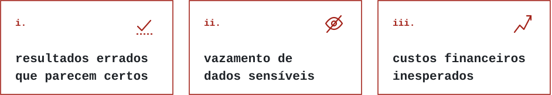
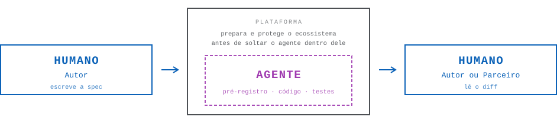
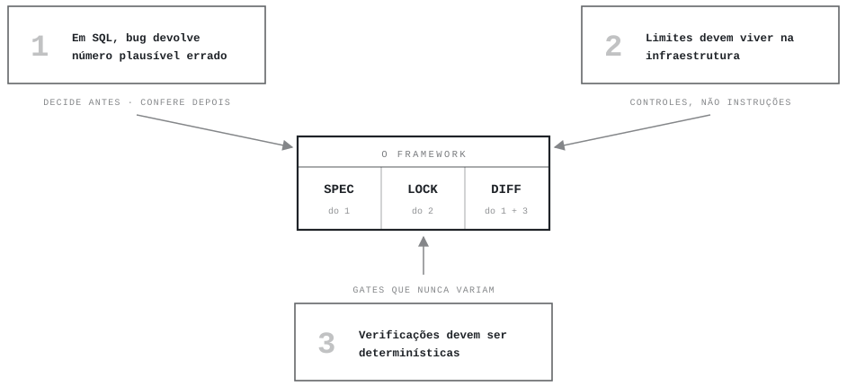
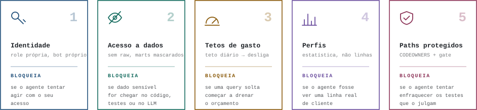
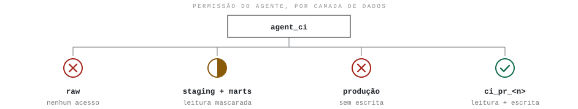
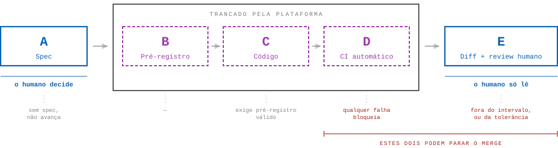
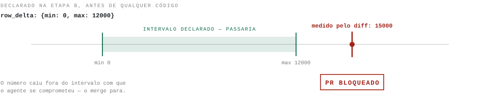
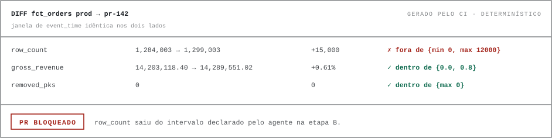

# Spec-Lock-Diff

[English](README.md) · **Português (pt-BR)**

<p align="center">
  <picture>
    <source media="(prefers-color-scheme: dark)" srcset="assets/wordmark-dark.svg">
    
  </picture>
</p>

<p align="center">
  
  
  <a href="LICENSE"></a>
  <a href="CONTRIBUTING.md"></a>
  
</p>

Um framework para desenvolvimento com dbt usando agentes de IA. O objetivo é reduzir os principais riscos que surgem quando um agente escreve SQL:

<p align="center">
  <picture>
    <source media="(prefers-color-scheme: dark)" srcset="assets/risks-pt-dark.svg">
    
  </picture>
</p>

O framework se resume em três fases:

- **Spec** — O humano define, em detalhes estruturados, o que o modelo dbt deve fazer _antes_ de qualquer código ser escrito.
- **Lock** — Restrições determinísticas. Limites de custo, acesso e comportamento ficam na infraestrutura (warehouse, CI, permissões), não em instruções de texto para o agente.
- **Diff** — Depois que o agente termina, o humano confere e revisa _números_ (diferenças entre produção e a versão nova), não código.

---

## Índice

0. [Papéis — quem faz o quê](#0-pap%C3%A9is--quem-faz-o-qu%C3%AA)
1. [Manifesto — 3 princípios](#1-manifesto--3-princ%C3%ADpios)
2. [Construindo a trava — 5 controles obrigatórios](#2-construindo-a-trava--5-controles-obrigat%C3%B3rios)
3. [O processo de desenvolvimento (rotina) — 5 etapas](#3-o-processo-de-desenvolvimento-rotina--5-etapas)

---

## 0. Papéis — quem faz o quê

Este framework define quatro papéis, cada um assume um papel por PR.

<p align="center">
  <picture>
    <source media="(prefers-color-scheme: dark)" srcset="assets/roles-pt-dark.svg">
    
  </picture>
</p>

| Papel          | Quem é                   | O que faz                                                                                          |
| -------------- | ------------------------ | ---------------------------------------------------------------------------------------------------- |
| **Plataforma** | Time infra/plataforma    | Configura os controles do setup (seção 2) uma única vez. Depois só garante que continuem funcionando. |
| **Autor**      | Um humano da equipe      | Escreve a spec do modelo. Aciona o agente. Lê o diff. É o responsável pelo PR.                      |
| **Parceiro**   | Outro humano (≠ Autor)   | Aprova PRs de modelos críticos.                                                                     |
| **Agente**     | A IA (LLM + ferramentas) | Escreve código, testes e o pré-registro numérico.                                                   |

---

## 1. Manifesto — 3 princípios

_Por que_ o framework existe. Todas as regras decorrem deles.

<p align="center">
  <picture>
    <source media="(prefers-color-scheme: dark)" srcset="assets/manifesto-pt-dark.svg">
    
  </picture>
</p>

| # | Princípio | Por que se sustenta | O que decorre dele |
|:-:|-----------|---------------------|--------------------|
| **1** | **Em SQL, bug não dá erro**<br>Dá um número plausível — e errado. | Erre um `JOIN` em Python e o programa quebra. Erre em SQL e a query roda normalmente, devolve `16.894.203,11`, informa `1 linha · sem erro`, e nunca menciona as linhas que duplicou. | O humano **decide antes**, escrevendo a spec, e **confere depois**, lendo o diff numérico.<br>Entre esses dois momentos o humano não faz nada — o agente trabalha sozinho no meio. |
| **2** | **Limites devem ser configurados na infraestrutura**<br>Não escritos e torcidos para dar certo. | "Não acesse dados sensíveis" num `AGENTS.md` é uma _instrução_, não um controle — o agente pode ignorar, esquecer ou interpretar diferente. `REVOKE USAGE ON SCHEMA raw` é um controle. | Controle de verdade é **negar permissões no banco**, um **resource monitor** que desliga o warehouse, uma **branch protection** que impede push em `main`.<br>Se o agente tentar violar, o sistema bloqueia — independentemente do que o prompt diz. |
| **3** | **As verificações devem ser determinísticas**<br>A mesma entrada, sempre o mesmo resultado. | LLMs são estocásticos por natureza, e tudo bem enquanto _geram_ código — o mesmo prompt devolve três joins diferentes. Não está tudo bem enquanto _julgam_. | Todo gate de verificação — testes, diffs, reconciliações — é determinístico.<br>Um LLM nunca é o juiz final de "o código está correto?". Quem julga são **testes automatizados, diffs numéricos e olhos humanos**. |

---

## 2. Construindo a trava — 5 controles obrigatórios

Esta seção é o framework inteiro. Você não está escrevendo regras para o agente obedecer — está construindo um ambiente em que as regras não podem ser quebradas. Uma vez que estes cinco controles estejam no lugar, o agente pode ser solto dentro deles e deixado para trabalhar sozinho: ele não consegue gastar dinheiro que não recebeu, ler dados que não lhe foram mostrados, nem mergear código que ninguém leu. É isso que compra a liberdade de parar de revisar o SQL dele linha por linha.

**Quem executa:** Plataforma. **Quando:** Uma única vez, antes do primeiro PR com agente.

> [!IMPORTANT]
> Não comece a construir nada sem antes configurar os controles.

<p align="center">
  <picture>
    <source media="(prefers-color-scheme: dark)" srcset="assets/controls-pt-dark.svg">
    
  </picture>
</p>

---

###  Controle 1: Identidade própria para o agente

**O que é:** O agente precisa ter sua própria identidade separada no warehouse e no git, com permissões restritas.

**Por que existe:** Se o agente usa as credenciais de um humano, ele herda todas as permissões desse humano. Se ele roda como admin, pode fazer qualquer coisa. Uma identidade separada com permissões mínimas limita o que o agente consegue fazer.

**Como implementar:**

No warehouse (Snowflake, BigQuery ou Databricks):

- Crie uma role chamada `agent_ci` (ou nome equivalente).
- Crie um usuário associado a essa role.
- Este usuário terá as permissões definidas nos controles 2, 3 e 4.

No git (GitHub, GitLab etc.):

- Crie um usuário bot para o agente.
- Este usuário **não pode** aprovar PRs.
- Este usuário **não pode** fazer merge.
- Este usuário **não pode** dar push direto em `main`.

Branch protection na `main` (todas obrigatórias):

- PR obrigatório para qualquer mudança.
- Review de CODEOWNERS obrigatório.
- Aprovações descartadas automaticamente a cada novo push (para que o agente não consiga "passar" uma aprovação antiga após mudar o código).
- Sem bypass para ninguém — inclusive admins.
- Status checks obrigatórios: CI (etapa D) e Diff (etapa E) do fluxo por PR.

Em toda branch (um ruleset que mira `*`, ou o equivalente):

- **Force-push bloqueado.** O gate antifraude (Controle 5B) percorre os commits do pull request para ver quando a spec e o pré-registro foram escritos pela primeira vez e quantas vezes mudaram. Um histórico reescrito — `commit --amend`, um rebase, um squash — é um histórico sem nada disso dentro, e nada do que o gate consegue ler avisa. Um agente que não consegue reescrever a branch não consegue apagar a evidência; um que consegue, consegue.

---

###  Controle 2: Acesso a dados restrito

**O que é:** O agente só vê o que precisa ver, e nunca vê dados sensíveis.

**Por que existe:** Um LLM que acessa dados brutos pode vazar informações pessoais (CPF, e-mail, endereço) no código, nos testes, nos comentários do PR ou até no log de conversação com o provedor do modelo.

**Como implementar:**

<p align="center">
  <picture>
    <source media="(prefers-color-scheme: dark)" srcset="assets/permissions-pt-dark.svg">
    
  </picture>
</p>

| Camada de dados             | Permissão do agente                                                                                                                                           |
| --------------------------- | ------------------------------------------------------------------------------------------------------------------------------------------------------------- |
| `raw` (dados brutos)        | **Nenhum acesso.** Nem `SELECT`, nem `DESCRIBE`.                                                                                                              |
| Staging e marts de produção | **Leitura com masking.** Colunas sensíveis são mascaradas (veja abaixo).                                                                                      |
| Produção (escrita)          | **Proibido.** O `profiles.yml` do agente não tem target `prod`. Ele não consegue escrever em produção mesmo que tente.                                        |
| Schema de trabalho          | **Leitura e escrita** em um schema exclusivo: `ci_pr_<número_do_PR>`. Criado quando o PR abre, dropado automaticamente quando o PR fecha (merge ou abandono). |

Masking de colunas sensíveis:

- No `.yml` de cada modelo dbt, toda coluna sensível deve ter `meta: {sensivel: true}`, ou mecanismo análogo.
- O masking é aplicado automaticamente pela role `agent_ci` ao consultar essas colunas.
- Implementação por plataforma:
    - **Snowflake:** use o pacote `dbt-snow-mask`.
    - **BigQuery:** use policy tags.
    - **Databricks:** use column masks.

---

###  Controle 3: Tetos de gastos

**O que é:** Limites financeiros que desligam o agente automaticamente quando atingidos.

**Por que existe:** Um agente pode gerar queries caras em loop (cross joins acidentais, full scans repetidos, loops infinitos).

**Como implementar:**

Custos de warehouse:

- **Snowflake:** Resource monitor com `FREQUENCY = DAILY` e ação `SUSPEND_IMMEDIATE`. A cota diária deve ser: (cota mensal ÷ 22 dias úteis). Quando atingida, o warehouse é desligado imediatamente.
- **BigQuery:** Cota diária de bytes escaneados no projeto de CI do agente.
- **Databricks:** O sistema de budgets do Databricks só envia alertas (não desliga). Então crie um job que roda a cada hora, consulta o consumo acumulado do dia e desliga o SQL warehouse do agente se estiver acima do teto.

Timeout por query:

- Configure `STATEMENT_TIMEOUT_IN_SECONDS` no usuário e no warehouse do agente. Se uma query demorar mais que o timeout, ela é cancelada automaticamente.

---

###  Controle 4: Estatísticas agregadas ao invés de acesso a registros reais

**O que é:** Em vez de permitir que o agente consulte linhas reais dos dados, forneça a ele um resumo estatístico pré-computado de cada modelo.

**Por que existe:** Se o agente roda `SELECT * FROM clientes`, ele vê nomes, e-mails, CPFs — dados reais. Mesmo com masking, quanto menos o agente vê, melhor. Um perfil estatístico dá ao agente informação suficiente para escrever SQL correto, sem expor nenhum dado individual.

**Como implementar:**

Crie um job semanal que:

1. Roda com a role `agent_ci`.
2. Para cada modelo dbt, gera um arquivo em `docs/profile/<nome_do_modelo>.yml`.
3. Cada arquivo contém, por coluna:
    - Contagem total de linhas.
    - Percentual de nulos.
    - Cardinalidade (quantidade de valores distintos).
    - Top 20 valores **apenas** em colunas marcadas com `meta: {categorica: true}` no `.yml` do modelo. Colunas sem essa tag não exibem valores individuais.
4. O perfil **não contém**: valores mínimos, valores máximos, amostras de dados, exemplos de linhas.

```yaml
# docs/profile/fct_orders.yml — regerado semanalmente, lido pelo agente
order_id:       {linhas: 1284003, nulos: 0.0%, distintos: 1284003}
customer_id:    {linhas: 1284003, nulos: 0.0%, distintos: 84120}
status:         {linhas: 1284003, nulos: 0.0%, distintos: 6,
                 top: [shipped, delivered, cancelled, ...]}   # categorica: true
customer_email: {linhas: 1284003, nulos: 1.2%, distintos: 83904}
# sem mínimos, sem máximos, sem amostras, sem exemplos de linhas
```

Quando o agente precisa entender a estrutura de um dado, ele consulta `docs/profile/`. Ele nunca roda queries exploratórias no warehouse.

---

###  Controle 5: Paths protegidos e gates anti-fraude

**O que é:** Certos arquivos e diretórios devem ser protegidos para que apenas humanos possam alterá-los. Além disso, um script de CI deve detectar se o agente tentou enfraquecer testes ou contornar proteções.

**Por que existe:** Um agente pode, sem má intenção, remover um teste que está falhando, alterar o resultado esperado de um teste para que ele passe, ou mudar uma config de segurança. Essas mudanças fazem o CI ficar verde, mas escondem bugs. Humanos precisam controlar os arquivos que definem as regras do jogo.

**Como implementar:**

**Parte A — CODEOWNERS (o git exige aprovação humana para estes paths):**

| Path protegido                               | Por que é protegido                                                                                                          |
| -------------------------------------------- | ------------------------------------------------------------------------------------------------------------------------------ |
| `.github/`                                   | Workflows de CI. Se o agente mudar o CI, ele controla as regras.                                                              |
| `.pre-commit-config.yaml`                    | Hooks de validação local.                                                                                                     |
| `CODEOWNERS`                                 | O arquivo que define quem aprova o quê.                                                                                       |
| `AGENTS.md`                                  | As regras do agente.                                                                                                          |
| `packages.yml`                               | Dependências do dbt. Um agente poderia pinar uma versão vulnerável.                                                           |
| `dbt_project.yml`                            | Configuração global do projeto.                                                                                               |
| `macros/`                                    | Macros são reutilizadas por vários modelos. Uma mudança afeta tudo.                                                           |
| `tests/`                                     | Testes genéricos.                                                                                                             |
| `analyses/reconciliation_*`                  | Queries de reconciliação. Se o agente mudar a reconciliação no mesmo PR do modelo, ele controla o que está sendo verificado.  |
| `models/semantic/`                           | Definições de métricas. Uma métrica errada propaga erro para todos os consumidores.                                           |
| `docs/profile/`                              | Perfis estatísticos. Se o agente mudar o perfil, ele muda sua própria referência.                                             |
| Modelos incrementais (listar explicitamente) | Modelos incrementais são mais complexos e frágeis.                                                                            |
| Diretórios de modelos críticos               | O dono do CODEOWNERS deve ser o data owner do domínio.                                                                        |

**Parte B — Gate anti-fraude:**

Um script que roda em CI nos pull requests que o bot abre — quem abre um pull request é uma identidade que a plataforma autentica, ao contrário do autor de um commit, que é texto — e julga todo commit dentro deles, seja quem for que o escreveu. Num pull request aberto por um humano ele roda e é consultivo: o CODEOWNERS (Parte A) julga esses. É o único script customizado que o framework exige. Ele analisa os diffs e **bloqueia o PR** se encontrar qualquer uma destas situações:

| Situação detectada                                    | Por que bloqueia                                                                                                                                |
| ----------------------------------------------------- | ------------------------------------------------------------------------------------------------------------------------------------------------- |
| Teste removido                                        | Um agente pode remover um teste que está falhando em vez de corrigir o código.                                                                   |
| `WHERE` ou cláusula de exclusão adicionada a um teste | Uma forma de fazer um teste passar sem corrigir o problema: filtrar os casos que falham.                                                          |
| `severity` rebaixada (ex: `error` → `warn`)           | Transformar um erro em aviso faz o CI passar, mas o problema continua.                                                                            |
| Valor `expect` alterado em um teste existente         | Se o agente muda o resultado esperado, qualquer resultado vira "correto".                                                                        |
| `analyses/reconciliation_*` alterado no mesmo PR do modelo     | O agente não pode mudar o modelo E a reconciliação que verifica o modelo no mesmo PR. Seria como um aluno escrevendo a prova e o gabarito.        |
| Pin de pacote alterado                                | Mudar versões de dependências pode introduzir comportamentos diferentes.                                                                         |
| Teste **adicionado** que não pode falhar               | Um teste que já nasce `enabled: false`, `severity: warn`, ou com um limiar que ele nunca alcança aparece no diff como trabalho feito e reporta aprovação faça o dado o que fizer. Um teste novo não pode ser *enfraquecido* — ele não tem um eu anterior —, então a regra sobre testes existentes nunca o vê. Um filtro (`where`) num teste novo é reportado, não bloqueado: pode ser recorte legítimo, e quais linhas ele remove é leitura de humano. Um teste singular em `tests/` carrega a config no próprio SQL, e é lido ali. |
| Caminho protegido (Parte A) alterado                    | O CODEOWNERS faz um humano aprovar; o gate faz disso um check vermelho, para que nos pull requests do agente ninguém precise reparar. Uma macro ou uma definição de generic test adicionada em `macros/` ou `tests/generic/` com o nome de um teste em uso substitui esse teste em todo lugar onde ele é declarado, e nenhum arquivo de teste do projeto muda — as linhas acima não veem nada. Um humano que precise mudar um caminho protegido faz isso num pull request próprio. |

**Opcional (camada extra de proteção):** Se o agente suportar hooks antes de executar ferramentas (ex: `PreToolUse` no Claude Code), configure um hook que recusa a escrita em paths protegidos na hora — antes mesmo do commit.

---

## 3. O processo de desenvolvimento (rotina) — 5 etapas

<p align="center">
  <picture>
    <source media="(prefers-color-scheme: dark)" srcset="assets/process-pt-dark.svg">
    
  </picture>
</p>

| Etapa | Nome                 | Quem executa                                | O que bloqueia o avanço                                                                         |
| ----- | -------------------- | ------------------------------------------- | ----------------------------------------------------------------------------------------------- |
| **A** | Spec                 | Autor (humano)                              | PR não pode avançar sem spec preenchida. Modelos críticos também exigem query de reconciliação. |
| **B** | Pré-registro         | Agente                                      | —                                                                                               |
| **C** | Código               | Agente                                      | Não pode começar sem pré-registro válido.                                                       |
| **D** | CI automático        | Automação (a cada push)                     | Qualquer falha bloqueia. Tempo máximo: ~15 minutos.                                             |
| **E** | Diff + review humano | A automação gera, o Autor ou Parceiro lê    | Diff fora do pré-registro bloqueia. Reconciliação fora da tolerância bloqueia.                  |

---

### Etapa A: Spec (Autor)

**O que é:** O Autor (humano) escreve uma especificação declarativa no `.yml` do modelo, dentro do bloco `meta.spec`. A spec define _o que o modelo deve fazer_ — não _como_.

**Onde fica:** No arquivo `.yml` do modelo dbt, dentro de `meta.spec`.

**Quando é obrigatória:** Em todos os modelos dentro de `models/marts/**`. Modelos em staging ou intermediate podem ter spec, mas não é obrigatório.

**Campos da spec (6 campos base + 3 adicionais para modelos críticos):**

```yaml
meta:
  spec:
    # --- 6 campos obrigatórios para todo modelo em marts/ ---

    grain: "uma linha por pedido por dia"
    # O que cada linha representa. É a definição mais importante do modelo.
    # Exemplo: "uma linha por cliente" ou "uma linha por transação por produto".

    primary_key: [order_id, date_day]
    # As colunas que juntas identificam uma linha de forma única.
    # O agente vai gerar um teste de unicidade para esta combinação.

    tier: critical  # Valores possíveis: "critical" ou "standard"
    # "critical" = modelo que alimenta decisões de negócio, relatórios financeiros
    #             ou dashboards executivos. Exige 3 campos extras (abaixo)
    #             e aprovação de um Parceiro.
    # "standard" = todo o resto.

    metrics:
      gross_revenue: "soma de order_total antes de descontos e impostos"
    # Cada métrica que o modelo calcula, com definição em linguagem natural.
    # O agente vai usar essas definições para escrever o SQL.
    # O diff (etapa E) vai comparar os valores dessas métricas entre
    # produção e a versão nova.

    known_edges:
      - "status='cancelled' → linha excluída"
      - "valor em centavos → dividir por 100"
      - "timestamp em UTC → converter para America/Sao_Paulo"
    # Casos especiais que o Autor já sabe que existem.
    # CADA borda se torna um unit test com fixture sintética.
    # A borda deve descrever o RESULTADO esperado, não a implementação.
    # Exemplo bom: "status='cancelled' → linha excluída"
    # Exemplo ruim: "usar WHERE status != 'cancelled'"

    sensitive_columns: [customer_email]
    # Lista de colunas que contêm dados pessoais.
    # O masking do Controle 2 será aplicado a estas colunas.

    # --- 3 campos adicionais, obrigatórios SOMENTE para tier: critical ---

    reconciliation_query: analyses/reconciliation_fct_orders.sql
    # Path de uma query SQL que compara o resultado do modelo com uma
    # fonte de verdade externa (outro sistema, planilha de fechamento etc.).
    # Esta query roda na etapa E com dado completo.

    reconciliation_tolerance: "0.1%"
    # A diferença máxima aceitável entre o modelo e a fonte de verdade.
    # Se a diferença for maior que isso, o PR é bloqueado.

    external_validation: "gross_revenue 2025-12 = R$ 14.203.118,40 no fechamento contábil"
    # Um número concreto de fora do warehouse que serve como âncora.
    # Isso existe porque a spec também pode errar.
    # Se a spec está errada, todos os testes vão passar (eles testam a spec),
    # mas o resultado final vai divergir do número real.
    # A validação externa pega esse caso.
```

**Regras importantes sobre a spec:**

1. O agente pode rascunhar uma versão inicial da spec a partir do perfil estatístico (Controle 4). Mas os 6 campos devem ser lidos e aprovados pelo humano **antes** de qualquer linha de código ser escrita.

2. A spec também pode estar errada. Um erro na spec é invisível para todos os gates automatizados (porque os testes verificam a spec, não a realidade). É exatamente por isso que o campo `external_validation` existe: ele ancora o modelo em um número que vem de fora do warehouse.

---

### Etapa B: Pré-registro (Agente)

**O que é:** Antes de escrever qualquer código, o agente declara quais mudanças numéricas ele _espera_ que aconteçam. Isso é feito em um bloco `pre_registration` no `.yml` do modelo.

**Por que existe:** Sem pré-registro, o agente vê os números do diff e depois inventa uma justificativa. O pré-registro inverte essa ordem: o agente se compromete com intervalos _antes_ de ver os resultados. Se os números caírem fora do intervalo, o PR é bloqueado automaticamente — o agente não consegue "ajustar" sua previsão depois.

<p align="center">
  <picture>
    <source media="(prefers-color-scheme: dark)" srcset="assets/pre-registration-pt-dark.svg">
    
  </picture>
</p>

> [!IMPORTANT]
> O pré-registro é imutável a partir do momento em que a etapa D (CI) começa. Se o agente alterar o pré-registro após o CI ter rodado, o CI é reexecutado do zero e um contador de alterações é incrementado no PR (visível para o Autor no review).

**Formato do pré-registro:**

```yaml
pre_registration:
  type: data_change
  # Valores possíveis:
  #   "data_change" — a mudança deve alterar resultados numéricos.
  #   "refactoring" — a mudança NÃO deve alterar nenhum resultado.
  #                   Se o type é "refactoring", todo delta DEVE ser 0.
  #                   Qualquer diferença numérica bloqueia o PR.

  reason: "incluir status='partially_shipped', antes excluído indevidamente"
  # Explicação em uma frase do porquê os números vão mudar.
  # O Autor vai ler isso no review e avaliar se o intervalo faz sentido
  # dado o motivo declarado.

  row_delta: {min: 0, max: 12000}
  # Quantas linhas a mais (ou a menos) o modelo terá em relação à produção.
  # REGRA: todo intervalo precisa ter min E max. Intervalo aberto
  # (ex: {min: 0} sem max) é inválido e é rejeitado pelo CI.

  removed_pks: {max: 0}
  # Quantas chaves primárias (linhas identificadas pela PK da spec)
  # existem em produção mas não existem na versão nova.
  # max: 0 significa "nenhuma linha deve desaparecer".

  altered_columns: [gross_revenue, order_count]
  # Lista exata das colunas cujos valores vão mudar.
  # Se no diff uma coluna que NÃO está nesta lista apresentar diferença,
  # o PR é bloqueado. Isso impede mudanças acidentais em colunas
  # que o agente não pretendia alterar.

  metrics:
    gross_revenue: {delta_pct: {min: 0.0, max: 0.8}}
    # Para cada métrica da spec, o intervalo percentual esperado de variação.
    # Exemplo: gross_revenue deve aumentar entre 0% e 0.8%.
    # Se a variação real for -1% ou +2%, o PR é bloqueado.
    #
    # Um modelo que não existe em produção não tem percentual a prever.
    # Declare o próprio valor, dentro da janela do diff, escrito em torno do
    # número da external_validation:
    #   gross_revenue: {value: {min: 14000000, max: 14400000}}
    # Uma métrica declara um dos dois, nunca ambos. row_delta passa a ser a
    # própria contagem de linhas, e altered_columns fica vazio.
```

**Quando é obrigatório:** Para todo modelo cujo código o PR altera. A etapa C não pode começar sem ele, e a etapa E não tem contra o que comparar sem ele — um modelo que chega ao diff sem pré-registro não é um modelo que reprova na comparação, é um modelo que ninguém comparou. Apagar a previsão não pode sair mais barato do que errar nela.

**De quem é:** Um pré-registro pertence a um pull request. Ele é escrito na branch, para a mudança que aquela branch faz. Um que é idêntico ao que a `main` já tem é a previsão da mudança anterior — feita contra outra produção, por outra razão — e não desta, e conta como ausente: o agente o substitui, não o herda. Depois do merge ele fica no `.yml` como registro do que foi previsto, até que a próxima mudança naquele modelo o substitua.

**Validação:** O pré-registro é validado por JSON Schema no CI (etapa D). Se o formato estiver errado, campos estiverem faltando, ou intervalos estiverem abertos, o CI falha.

---

### Etapa C: Código (Agente)

**O que é:** O agente escreve o código SQL, os testes e tudo que é necessário para implementar a spec. Ele segue 8 regras, documentadas no arquivo `AGENTS.md` (que é protegido pelo Controle 5 — apenas humanos podem alterá-lo).

**As 8 regras do agente:**

Cada regra abaixo deve ter um mecanismo de infraestrutura que a impõe. A regra em texto existe apenas para que o agente entenda a intenção; o mecanismo existe para que a regra funcione mesmo que o agente a ignore.

| #   | Regra                                                                                                                                                                                                                                                                 | Mecanismo que impõe                                                                                             |
| --- | --------------------------------------------------------------------------------------------------------------------------------------------------------------------------------------------------------------------------------------------------------------------- | --------------------------------------------------------------------------------------------------------------- |
| 1   | **Sem spec, pare e peça.** Se o modelo não tem spec, o agente não começa. Ele pede ao Autor para escrevê-la.                                                                                                                                                          | CI valida presença da spec (JSON Schema).                                                                       |
| 2   | **Todo modelo tem teste de PK e contagem mínima.** O agente cria um teste de unicidade na primary_key da spec e um teste de contagem mínima de linhas. Cada borda da spec vira um unit test com fixture sintética (dados inventados que representam o caso descrito). | CI valida presença dos testes (JSON Schema + gate anti-fraude).                                                 |
| 3   | **Teste falhou = código errado.** Se um teste falha, o agente corrige o código. Nunca o contrário. O agente nunca enfraquece um teste, altera um `expect`, muda uma macro de teste ou remove uma reconciliação para fazer o CI passar.                                | Gate anti-fraude (Controle 5B) detecta e bloqueia.                                                              |
| 4   | **Métricas ficam em `models/semantic/`.** Métricas são definidas uma única vez, no diretório semântico. Se a métrica que o agente precisa não existe, ele para e pede ao Autor para criá-la.                                                                          | CODEOWNERS protege `models/semantic/`.                                                                          |
| 5   | **Ordem de execução fixa.** O agente segue esta sequência: `dbt compile` → `dbt test --select test_type:unit` → `dbt build`. Se o mesmo comando falhar 3 vezes seguidas, o agente para e chama um humano.                                                             | Regra de 3 falhas no gateway de API.                                                                            |
| 6   | **Pré-registro antes do diff.** O agente deve entregar o pré-registro (etapa B) antes de qualquer diff. Intervalos abertos (sem min ou sem max) são inválidos.                                                                                                        | JSON Schema no CI.                                                                                              |
| 7   | **Nunca leia linhas individuais.** O agente não roda `dbt show`, não faz `SELECT` sem agregação, e nunca cola um valor lido do warehouse em código, teste, fixture ou comentário de PR. Fixtures são sempre sintéticas (inventadas pelo agente).                      | Role `agent_ci` sem acesso a `raw`. Masking em staging/marts. Gate anti-fraude detecta dados reais em fixtures. |
| 8   | **Não edite paths protegidos.** Se a tarefa exige mudar um arquivo protegido (macros, CI, testes genéricos etc.), o agente para e pede ao Autor.                                                                                                                      | CODEOWNERS bloqueia merge sem aprovação humana; o gate antifraude (Controle 5B) bloqueia o PR.                  |

---

### Etapa D: CI automático (a cada push)

**O que é:** Um pipeline de CI que roda automaticamente toda vez que o agente faz push na branch do PR. Deve completar em menos de 15 minutos.

**O que roda (nesta ordem):**

```bash
# 1. Validações estáticas (pre-commit hooks)
pre-commit run --all-files
```

O pre-commit executa:

- **JSON Schema:** valida que a spec, o campo `sensivel`, o pré-registro e os testes obrigatórios existem e estão no formato correto.
- **Gitleaks:** detecta segredos vazados, incluindo regras customizadas para e-mail e CPF.
- **Gate anti-fraude:** o script do Controle 5B roda sobre os commits do bot.

```bash
# 2. Build com amostra
dbt build --select state:modified+ --defer --state ./prod-artifacts --sample "30 days"
```

O build inclui:

- **Fusion em `static_analysis: baseline`** — detecta colunas inexistentes e tipos errados antes de executar qualquer query (análise estática do SQL).
- **Unit tests** gerados a partir das bordas da spec.
- **Teste de unicidade** da primary_key da spec.
- **Teste de contagem mínima** — o limiar é ajustado proporcionalmente à janela de amostra (ex: se a amostra é 30 dias e a tabela tem 365 dias, o limiar mínimo é 30/365 do limiar cheio).
- **Contracts** nos modelos de marts (garantem que colunas e tipos estão corretos).
- **dbt-project-evaluator** — detecta problemas estruturais no projeto.

**Por que rodar hooks no CI se eles já rodam localmente:** Porque `git commit --no-verify` pula todos os hooks locais. Se alguém (ou o agente) usar essa flag, os hooks não rodam. O CI garante que a validação acontece de qualquer forma.

---

### Etapa E: Diff + review humano (uma vez por PR)

**O que é:** Um `dbt build` completo (sem amostra) seguido de um diff numérico entre a versão nova e a produção atual. Roda quando o PR é marcado como ready-for-review, e de novo a cada push depois disso — o Controle 1 descarta uma aprovação a cada push, e um diff de um código que mudou desde então vale o mesmo. Enquanto o PR é rascunho ele não roda, e é por isso que o agente abre o PR como rascunho e o marca como pronto quando a etapa C termina.

**O diff é produzido pela automação, de forma determinística** — o mesmo build, a mesma janela fechada de `event_time`, a mesma comparação, todas as vezes. Nem um humano nem o agente monta esse diff ad hoc, e nenhum dos dois escolhe quais números aparecem. O trabalho do humano nesta etapa é inteiramente _ler_.

<p align="center">
  <picture>
    <source media="(prefers-color-scheme: dark)" srcset="assets/diff-pt-dark.svg">
    
  </picture>
</p>

**O que roda (nesta ordem):**

**Passo 1 — Build com dado completo**

O build roda em um schema separado chamado `ci_pr_<n>_full`:

```bash
# Para modelos padrão: constrói apenas o modelo alterado
dbt build --select state:modified --defer --state ./prod-artifacts

# Para modelos críticos: constrói o modelo alterado E todos os modelos
# que dependem dele (downstream), usando o operador "+"
dbt build --select state:modified+ --defer --state ./prod-artifacts
```

Por que modelos críticos usam `state:modified+` (com o `+`): Sem o `+`, os modelos downstream seriam construídos sobre os dados intermediários de **produção** (via `--defer`), não sobre a versão alterada. O diff mostraria diferenças apenas no modelo alterado, não nos marts que o consomem. Com o `+`, toda a cadeia downstream é reconstruída, e o diff captura o efeito completo da mudança.

**Passo 2 — Data diff agregado**

Usando Recce ou `dbt-audit-helper` em modo resumo (nunca em modo que mostre linhas individuais de colunas sensíveis):

- O diff é calculado sobre uma **janela fechada de `event_time`**, idêntica nos dois lados (produção e versão nova). Isso é essencial: se a produção tem dados até ontem e a versão nova tem dados até hoje, as linhas de "hoje" apareceriam como diferenças falsas.
- O diff publica: contagem de linhas, PKs removidas, colunas com valores alterados, e o valor de cada métrica definida na spec.
- Para um modelo que a produção não tem, não há delta a publicar: o diff publica o próprio valor de cada métrica, na janela, e o compara com o intervalo de valor que o pré-registro declarou (etapa B).

**Passo 3 — Comparação com o pré-registro**

Cada número do diff é comparado automaticamente com os intervalos declarados no pré-registro (etapa B). O PR é **bloqueado** se qualquer uma destas condições for verdadeira:

- Um número está fora do intervalo declarado (ex: delta de linhas é 15.000, mas o pré-registro disse `max: 12000`).
- Uma coluna apresenta diferença mas não está na lista `altered_columns` do pré-registro.
- Uma métrica pré-registrada por valor cai fora do intervalo dela — ou um modelo que a produção não tem foi pré-registrado por percentual, quando não há número de produção do qual tirar um percentual.
- O type é `refactoring` mas algum delta não é zero.

**Passo 4 — Reconciliação (apenas modelos críticos)**

Para modelos com `tier: critical`, a query de reconciliação (`reconciliation_query`) roda em dado completo e compara o resultado com a tolerância declarada (`reconciliation_tolerance`). Se a diferença for maior que a tolerância, o PR é **bloqueado**.

> [!CAUTION]
> Este é o único gate capaz de detectar o caso em que a IA presumiu errado o significado de uma coluna. Se o agente acha que `order_total` é bruto mas na verdade é líquido, os unit tests passam (eles testam o que a spec diz), mas a reconciliação contra o sistema contábil falha.

**Passo 5 — Review humano: três leituras**

O Autor (e o Parceiro, se o modelo for crítico) lê exatamente três coisas.

| # | Pergunta                                                                              | O que estou procurando                                                                                                                                    |
| - | ------------------------------------------------------------------------------------- | ----------------------------------------------------------------------------------------------------------------------------------------------------------- |
| 1 | O grain da spec é o grain desejado?                                                   | Verificar se a definição de "uma linha" faz sentido para o negócio.                                                                                        |
| 2 | O pré-registro é estreito o bastante para poder falhar? O motivo justifica o intervalo? | Um pré-registro que diz `row_delta: {min: -999999, max: 999999}` é inútil — ele nunca falha. O intervalo deve ser apertado o suficiente para pegar erros reais. |
| 3 | Os `expect` dos unit tests dizem o mesmo que as bordas da spec?                        | Verificar se o agente traduziu as bordas da spec corretamente nos testes.                                                                                  |

**Regras de aprovação:**

- Modelo **padrão**: o Autor aprova.
- Modelo **crítico**: um Parceiro (≠ Autor) aprova. O CODEOWNERS impõe isso.
- Macros, modelos incrementais e `models/semantic/`: sempre passam por aprovação humana, independentemente do tier. O CODEOWNERS impõe.

---

## Licença

[MIT](LICENSE) © Matheus Miloski. Contribuições são bem-vindas — veja [CONTRIBUTING.md](CONTRIBUTING.md).
