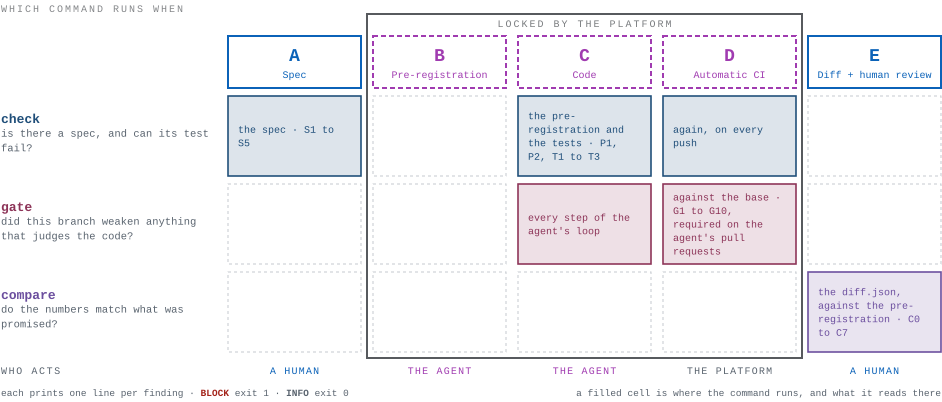

# `tools/` — the deterministic gates of Spec-Lock-Diff

**English** · [Português (pt-BR)](README.pt-br.md)

<p align="center">
  
  
  
  
</p>

Three commands, thirty rules, one file.

<p align="center">
  <picture>
    <source media="(prefers-color-scheme: dark)" srcset="../assets/commands-en-dark.svg">
    
  </picture>
</p>

```
python tools/slp.py check   [--project-dir .] [--marts-path models/marts]
python tools/slp.py gate    --base <git ref> [--head HEAD] [--project-dir ...] [--marts-path ...]
python tools/slp.py compare <diff.json> [<diff.json> ...] [--base <git ref>] [--project-dir ...]
python tools/slp.py --version
```

Every rule enforces a sentence of the [framework README](../README.md); where
the framework says nothing, these tools do nothing. When a rule fires it names
the file, the model, what it wanted, and itself:

```
$ python tools/slp.py gate --base main
BLOCK	models/marts/fct_orders.yml	fct_orders	test 'unique' on fct_orders.order_id exists on main but not in this PR	[G1]
slp gate: 1 block - BLOCKED
```

> **Work in progress.** The first reference implementation — deliberately
> small, and yours to adapt. If you improve it, open a *Field report* or a PR.

**Contents**

1. [Install](#1-install)
2. [Stage A and C — `check`](#2-stage-a-and-c--check)
3. [Stage C and D — `gate`](#3-stage-c-and-d--gate)
4. [Stage E — `compare`](#4-stage-e--compare)
5. [The `diff.json` contract](#5-the-diffjson-contract)
6. [Reading a run](#6-reading-a-run)
7. [The rules](#7-the-rules)
8. [What v0 does not do](#8-what-v0-does-not-do)
9. [Contributing](#9-contributing)

---

## 1. Install

**You need** Python 3.9+ and git 2.20+. Then one of two ways in.

| | How | What it buys, and what it costs |
| --- | --- | --- |
| **Vendored** | `pip install "pyyaml" "jsonschema>=4"`, then copy `tools/` next to your `dbt_project.yml` — the folder, not the file, because `slp.py` reads its schemas from the directory beside it. | Nothing in the trust root but a file you can read: no index, no network, and the gate sits in your repository where its diff is reviewable. |
| **Installed** | `pipx run spec-lock-diff check`, or `pip install spec-lock-diff`. For CI, put the version in a `.slp-version` file at the repository root and the workflow installs exactly that. | One line instead of a folder. It also puts an index in the trust root, which vendoring does not — which is why the workflow reads the pin from the branch the pull request targets, and why `.slp-version` is a protected path. |

The wheel carries the tool and its schemas, not the templates or the tests:
those live in this repository, at the tag of the version you pinned. Either way
the command is named `slp`; this document writes `python tools/slp.py`, which is
the vendored spelling, throughout.

If dbt is installed you have both libraries already. The jsonschema floor is not
decoration — the schemas are draft 2020-12 and its validator arrived in 4.0; on
3.x the tools fail to start rather than fall back. If your system has no bare
`python`, read `python3` for every `python` in this document.

Then climb. Each rung below is green on its own and worth something on its own,
and no rule on a rung you have reached is weaker for the rungs you have not.
Stop where the value stops.

### Rung 1 — `check`, on your machine

```bash
python tools/slp.py check
```

Every model in `models/marts/` has a complete spec, a valid pre-registration if
it has one at all, and a uniqueness test on its primary key that could actually
fail. No CI, no warehouse, no git, no dbt. This is the whole of
[section 2](#2-stage-a-and-c--check), and it is Stage A with a machine reading
over your shoulder.

One rule here reaches for a file that belongs to rung 3: `S5` asks that a
critical or incremental model be owned by somebody in CODEOWNERS, and blocks
while it is not. Write that file early, or start with `tier: standard`.

No project of your own yet? There is one in
[`examples/quickstart`](../examples/quickstart/README.md) — two marts, one
standard and one critical, with their specs, their pre-registrations and their
diffs — and a list of things to break on purpose to watch a rule fire:

```bash
python tools/slp.py check --project-dir examples/quickstart
```

### Rung 2 — `check` and `gate` in CI, still with no warehouse

| Copy | To | Then edit |
| --- | --- | --- |
| `tools/templates/ci.yml` | `.github/workflows/ci.yml` | Nothing, to begin with. Set the repository variable `AGENT_LOGIN` to the agent's bot user, so the gate is required on the pull requests it opens and advisory on yours. |

Twenty-one of the thirty rules and the whole of Control 5B, for one file and one
variable. It installs Python and two libraries — no adapter, no credential, and
not one `exit 1` — so the first run is green. List `ci` as a required check.

### Rung 3 — the paths nobody may quietly edit

| Copy | To | Then edit |
| --- | --- | --- |
| `tools/templates/CODEOWNERS` | `.github/CODEOWNERS` | Replace `@your-org/data-platform`; list your incremental models and critical directories. It follows the framework's protected-path table row by row. |
| `tools/templates/AGENTS.md` | `AGENTS.md` | Keep its protected-path list identical to your CODEOWNERS. Nothing in it is a control — it tells the agent what the machines will do, so it does not spend a pull request finding out. |

**Turn on branch protection** for `main`: require pull requests, require review
from Code Owners, and block force-push on every branch — three gate rules read
the branch's history, and a rewritten history is one they cannot see.

### Rung 4 — the controls that are not code

Controls 1 to 4 of the [framework README](../README.md#2-building-the-lock--5-mandatory-controls):
the agent's own identity, restricted data access, spending caps, and statistical
profiles instead of rows. Nothing in `tools/` enforces these and nothing here
could — they are permissions, monitors and masks, not a script. This is the rung
that makes the numbers on the next one worth reading.

### Rung 5 — Stage E, the diff

| Copy | To | Then edit |
| --- | --- | --- |
| `tools/templates/ci-warehouse.yml` | `.github/workflows/ci-warehouse.yml` | Write your adapter, warehouse auth, production artifacts, the sample build, the full build and the diff. **Six steps exit 1 until you do** — a template shipped unedited fails closed. |

Add `build` and `diff` to the required checks. The largest of those steps is the
diff itself, and it is the one thing these tools do not do for you:
[section 5](#5-the-diffjson-contract) is its contract, and shows a query to
start from.

**Check it runs, then run its own tests** — around three hundred and fifty of
them, a few seconds, no network. If they pass, the gates on your machine are the
gates in CI.

```bash
python tools/slp.py --version
pip install pytest && pytest tools/tests -q
```

---

## 2. Stage A and C — `check`

`check` asks one question of every model in `models/marts/`: does it have a
complete spec, a valid pre-registration if it has one at all, and a uniqueness
test on its primary key that could actually fail? It reads yml and one line of
sql, never calls git, and never touches the warehouse.

**Runs at** Stage A while the Author writes the spec, Stage C before the agent
commits, and Stage D in CI on every push.

```
$ python tools/slp.py check
slp check: OK (1 model in models/marts/, of 1 model read)

$ python tools/slp.py check
BLOCK	models/marts/fct_orders.yml	fct_orders	the uniqueness test on primary key [order_id] cannot fail the build: it sets where	[T1]
slp check: 1 block - BLOCKED
```

Both come from `tests/fixtures/check/spec_ok` and `check/pk_test_where`; run
them yourself with `--project-dir`.

**Where it looks.** `models/marts/`, because that is where the framework makes
the spec mandatory. Elsewhere, say so, repeating the flag per directory — and
pass the same paths to `gate` and `compare`:

```
python tools/slp.py check --marts-path models/core --marts-path models/finance
```

- **A path that is not a directory is exit 2, not a pass.** A tool pointed at a
  folder that is not there finds nothing wrong with anything, and that reads
  exactly like a clean run.
- **The summary line gives two numbers**: how many models were *held to the
  framework*, and how many were read in all. Only the first is coverage.
- **A model is a marts model when its `.sql` lives in a marts path** — not when
  the yml documenting it does. A project with one `models/schema.yml` for
  everything, which is what `dbt init` scaffolds, is ordinary dbt; deciding by
  the yml would have exempted every model in it from `S1`, `T1` and `G7` while
  `check` printed `OK`.

**A test that cannot fail is a box ticked.** `T1` accepts only a uniqueness test
that can fail the build. `enabled: false`, `severity: warn`, or a `where`,
`error_if`, `warn_if`, `fail_calc` or `limit` all report a pass whatever the data
does — `unique` with `where: "1 = 0"` looks at no rows at all. `check` says which
of those it found.

**What CODEOWNERS owns.** Two approval rules are not about the yml at all: a
Partner approves a critical model, and incremental models are listed explicitly
because no selector can tell one from another. Both degrade silently — a critical
model in a directory no CODEOWNERS line covers merges on the Author's approval
alone. So `S5` reads `.github/CODEOWNERS` (or `CODEOWNERS`, or `docs/CODEOWNERS`)
the way git does — gitignore patterns, last matching line wins, a line with no
owner un-owns — and blocks when such a model's sql or yml is owned by nobody. It
cannot say whether the owner is the *right* team; it can say whether there is one.

---

## 3. Stage C and D — `gate`

`gate` compares this branch with the point it started from and blocks the pull
request if anything that judges the code got weaker: a test, a unit test, a
reconciliation query, a package pin, or the spec itself. Rule 3 of the framework
is *test failed = code wrong*; the gate is what makes that more than a wish.

It asks git for the **merge-base** of `--base` and `--head`, not the tip of
`main`, so a branch that moved on does not look like your branch removing
things. A test is identified by its model, column, name and arguments, so moving
it between files or renaming `tests:` to `data_tests:` changes nothing, while
shrinking an `accepted_values` changes everything.

**Runs at** Stage C before the agent commits (`--base main`), and Stage D in CI
on every push, with both ends of the pull request.

```
$ python tools/slp.py gate --base main
BLOCK	models/marts/fct_orders.yml	fct_orders	the sql of this model changed on this branch and it carries no meta.pre_registration; nothing downstream has an interval to hold its numbers against, and compare will not so much as look at it	[G8]
slp gate: 1 block - BLOCKED
```

In CI, pass both ends explicitly and check out the whole history — three rules
walk the commits:

```yaml
- uses: actions/checkout@v4
  with:
    fetch-depth: 0
- run: |
    python tools/slp.py gate \
      --base ${{ github.event.pull_request.base.sha }} \
      --head ${{ github.event.pull_request.head.sha }}
```

**The pre-registration is not optional.** `G8` blocks when a marts model's `.sql`
changed and no `meta.pre_registration` is there to hold its numbers against — or
when the one there is the one `main` already had. A pre-registration belongs to
one pull request: it stays in the yml after a merge as the record of what was
predicted, so the next change finds one written for another change against
another production, and one identical to the merge-base's counts as absent. It
is scoped to the `.sql` because the framework ties the interval to writing code;
adding a test or documenting a column does not ask for one.

**What the yml cannot show.** dbt resolves macros from the project before its
own, so a `` under `tests/generic/` or `macros/` replaces the
built-in everywhere it is declared, and a singular test under `tests/` carries
its `severity` inside its own `{{ config() }}` — weakenings no model yml records.
So `G9` blocks any change to a protected path (`.github/`,
`.pre-commit-config.yaml`, `CODEOWNERS`, `AGENTS.md`, `dbt_project.yml`,
`macros/`, `models/semantic/`, `docs/profile/`, `tools/`) and any file added
under `tests/generic/`; `G10` reads the `config()` of every singular test the
branch adds. Paths with a rule of their own keep it, so one change is one
finding: package files are `G6`, `analyses/reconciliation_*` is `G5`, an existing
test file is `G1`.

**Who it blocks.** Inside a pull request the gate judges every commit, whoever
wrote it — a commit author is text anyone can write. Which pull requests it
*blocks* is decided by who opened them, an identity the platform authenticates:
`templates/ci.yml` requires the gate on pull requests opened by `AGENT_LOGIN`
and runs it advisory on everyone else's, where findings go to the job summary and
CODEOWNERS decides. Unset, it is required everywhere — a variable nobody set must
not make a gate optional. So in an agent's pull request nobody weakens a test,
agent or human; a human who must change a test, a macro, a package pin or the CI
does it **before the agent starts**, or in a pull request of their own.

---

## 4. Stage E — `compare`

`compare` reads the numbers your diff measured and holds each against the
interval the pre-registration declared before any code was written: row delta,
removed primary keys, altered columns, every metric, and — for critical models —
the reconciliation against its tolerance. It does not produce the diff and does
not run the reconciliation query; those touch the warehouse.

**Runs at** Stage E, once per pull request, after the full build.

Two flags decide whether it can do its job:

- **Hand it every diff your build produced, in one call** —
  `compare diff/*.json`, not one call per file. `C7` blocks a pre-registered
  model whose numbers never turned up, and a rule about what is *missing* can
  only see what it was given.
- **Pass `--base <git ref>`**, the branch the pull request targets, as
  `templates/ci-warehouse.yml` does. Then a pre-registration still identical to
  the merge-base's is `main`'s prediction, not this pull request's: `C7` does not ask
  for its diff, and a diff measured against it is refused (`C0`). Without
  `--base`, every pre-registration in the project counts as this one's —
  stricter, never looser, but a local run can block for a model you never touched.

```
$ python tools/slp.py compare diff.json
INFO	diff.json	fct_orders	declared as a data_change, because: include status partially_shipped, previously excluded incorrectly	[I2]
INFO	diff.json	fct_orders	row_delta 8400, declared 0..12000 (a band 12000 wide)	[I2]
INFO	diff.json	fct_orders	removed_pks 0, declared at most 0	[I2]
INFO	diff.json	fct_orders	metric gross_revenue moved 0.42 percent, declared 0.0..0.8 (a band 0.8 wide)	[I2]
INFO	diff.json	fct_orders	altered columns measured [gross_revenue], declared [gross_revenue]	[I2]
INFO	diff.json	fct_orders	this diff declares no window; README §3 Stage E step 2 asks for a closed event_time window identical on both sides, and nothing here can check that	[I2]
slp compare: 6 infos - OK
```

Nothing blocked, and `I2` printed every number anyway. That is the point of it:
Stage E asks the Author *"is the pre-registration narrow enough to be able to
fail?"*, and a `row_delta` of 8,400 inside a band 12,000 wide is a different
review from the same 8,400 inside a band 200 wide. So `compare` prints the reason
given, every number, its band, and how wide that band is. The last line is the
tool naming a promise it cannot keep for you — nothing here can verify the window
was closed and identical on both sides.

---

## 5. The `diff.json` contract

One file per model, written by whatever measures your diff. The keys mirror the
pre-registration on purpose, so the comparison is key by key. `compare` rejects
keys it does not know, which is what stops a typo being read as "nothing changed".

| Key | Type | Required | Meaning |
| --- | --- | --- | --- |
| `model` | string | yes | the dbt model these numbers were measured on |
| `row_delta` | integer | yes | rows in the PR build minus rows in production, inside the window |
| `removed_pks` | integer ≥ 0 | yes | primary keys present in production and absent in the PR build |
| `altered_columns` | array of strings | yes | columns with at least one PK-matched row whose value differs |
| `metrics` | object of `{delta_pct: number or null, value: number}` | yes (may be `{}`) | one measurement per metric; `value` when production has no such model |
| `reconciliation` | `{model_value, external_value}` | no | critical models |
| `window` | `{column, start, end}` | no | printed by `compare` for the reviewer |
| `extra` | object | no | anything else you want to carry; ignored |

**The unit and sign of `delta_pct`.** Percentage *points*, as a plain number,
computed as `(pr − prod) / prod × 100`.

> Production sums 1,000,000.00 of `gross_revenue` in the window. The PR build
> sums 1,008,000.00. Then `delta_pct` is
> `(1008000 − 1000000) / 1000000 × 100 = 0.8` — the number **0.8**, not 0.008
> and not 80. A pre-registration of `{min: 0.0, max: 0.8}` accepts it, at the
> edge. If the PR build sums *less* than production the number is negative.
> When production is 0 the percentage does not exist: write `null`, and
> `compare` blocks, because a number nobody can evaluate is not a number
> anybody approved.

**A model production does not have** — an agent building a new mart from a spec —
has no production side and so no percentage to predict. There the
pre-registration declares `value: {min, max}` instead, written around the number
in `external_validation`, and the diff carries `value`, the metric's value in the
PR build inside the window. `row_delta` is then the row count itself, and
`altered_columns` is `[]` on both sides.

**Where the numbers come from.** Anything deterministic: Recce,
`dbt-audit-helper` in summary mode, or your own SQL. The window must be closed
and identical on both sides — if production has data up to yesterday and the PR
build up to today, "today" shows up as a false difference. A starting point,
adapt freely:

```sql
-- YOU: your schemas, your model, your window, your metrics.
with prod as (
    select * from analytics.fct_orders
    where order_date >= date '2025-01-01' and order_date < date '2025-02-01'
),
pr as (
    select * from ci_pr_42_full.fct_orders
    where order_date >= date '2025-01-01' and order_date < date '2025-02-01'
),
matched as (
    select
        prod.order_id       as prod_key,
        pr.order_id         as pr_key,
        prod.gross_revenue  as prod_gross_revenue,
        pr.gross_revenue    as pr_gross_revenue
    from prod
    left join pr on prod.order_id = pr.order_id   -- the spec's primary_key
)
select
    (select count(*) from pr) - (select count(*) from prod)         as row_delta,
    sum(case when pr_key is null then 1 else 0 end)                 as removed_pks,
    sum(case when pr_key is not null
              and prod_gross_revenue is distinct from pr_gross_revenue
             then 1 else 0 end)                                     as gross_revenue_changed,
    100.0 * ((select sum(gross_revenue) from pr)
             - (select sum(gross_revenue) from prod))
          / nullif((select sum(gross_revenue) from prod), 0)         as gross_revenue_delta_pct
from matched
```

**One row out, one `diff.json` in.** That translation is
[`templates/diff_to_json.py`](templates/diff_to_json.py) — stdlib only, no
network, nothing to configure. It reads one row of CSV or JSON and knows the
columns by their suffixes, so name them after your metrics and hand it over:

```bash
python tools/templates/diff_to_json.py --model fct_orders --out diff/fct_orders.json < row.csv
```

| Column in the row | Where it goes |
| --- | --- |
| `row_delta`, `removed_pks` | the two required integers |
| `<metric>_delta_pct` | `metrics.<metric>.delta_pct`. Empty stays `null` — which is what the `nullif` above already wrote when production was 0 |
| `<metric>_changed` | above zero, `<metric>` joins `altered_columns` |
| `<metric>_value` | `metrics.<metric>.value`, for a model production does not have |
| `reconciliation_model_value`, `reconciliation_external_value` | the `reconciliation` pair a critical model owes |
| `window_column`, `window_start`, `window_end` | the `window` `compare` prints for the reviewer |

Anything else in the row is ignored, so the query may select more than this
needs. For a multi-column key, join on every column. Writing the JSON yourself is
fine too: the table in this section is the whole contract.

**If you already run something.** Recce's row-count and value diffs, and
`dbt-audit-helper`'s `compare_relations` in summary mode, both measure these
numbers — name their output columns as above and the same converter finishes the
job. Summary mode only: Control 4 says the agent sees aggregates and never rows,
and a diff artifact is read by everyone who opens the pull request.

---

## 6. Reading a run

One line per finding, tab-separated, then one summary line. Everything on stdout;
errors that stop the tool go to stderr.

```
BLOCK	models/marts/fct_orders.yml	fct_orders	test 'unique' on fct_orders.order_id exists on main but not in this PR	[G1]
INFO	models/marts/fct_orders.yml	fct_orders	pre-registration was modified 1 time after it was first written	[I1]
slp gate: 1 block, 1 info - BLOCKED
```

| Severity | Meaning |
| --- | --- |
| `BLOCK` | Something is wrong. Sets exit code 1. |
| `INFO` | Something the reviewer should see. Never changes the exit code. |

| Exit code | Meaning | What CI does |
| --- | --- | --- |
| 0 | Nothing to report | pass |
| 1 | At least one `BLOCK` | fail |
| 2 | The tool could not do its job: a file it cannot read, yml it cannot parse, a bad argument, not a git repository | fail |

**Exit 2 is a failure, never a pass.** What cannot be read cannot be approved; a
silent pass is the exact failure this framework exists to prevent.

**Three questions, in this order.**

1. **Did it exit 2?** Then nothing was judged. Fix that first — an exit 2 tells
   you nothing about the code.
2. **Is there a `BLOCK`?** Each names what was measured and what was promised,
   and ends in a rule id you can look up in [section 7](#7-the-rules). A `gate`
   block is almost never something to work around: it is a test that got weaker,
   and Rule 3 says the code is what changes.
3. **Then read the `INFO` lines.** They never change the exit code, which is
   exactly why they are easy to skip and worth not skipping. This is why
   both workflow templates pipe what they run into the job summary.

**A run that blocks nothing is not a run that found nothing to look at.**
`slp check: OK (3 models in models/marts/, of 40 models read)` is a coverage
statement — read the first number. A green that means *"I did not look"* is the
failure the framework exists to prevent.

Findings sort by file, then model, then blocks before infos, then rule id; ties
keep the order the rule produced them in. The same files in give the same lines
out, on every machine.

**Where the tools look for things.** dbt 1.10 moved `meta` under `config`, so
both spellings are read. Both present for the same thing is exit 2, "ambiguous:
defined twice" — the tool does not guess which one you meant.

| Thing | Classic | dbt 1.10+ |
| --- | --- | --- |
| spec | `models[].meta.spec` | `models[].config.meta.spec` |
| pre-registration | `models[].meta.pre_registration` | `models[].config.meta.pre_registration` |
| sensitive flag | `columns[].meta.sensitive` | `columns[].config.meta.sensitive` |
| data tests | `tests:` | `data_tests:` |
| test arguments | on the test: `- accepted_values: {values: [...]}` | under `arguments:` |

Moving a test's arguments under `arguments:` is not "changed its arguments".
`tags`, `meta`, `description`, `name`, `store_failures` and the other keys that
say neither what a test asserts nor whether it can fail are read and never
compared, so adding a tag to a test is not a finding either.

---

## 7. The rules

One row per rule: what it blocks, where the framework asks for it, and the two
fixtures the meta-tests hold it to — one where it fires, one where it stays
silent. **M2** fails if a rule has no row, or a row names a fixture that does not
do what it says.

Tags: `§1 P`*n* a principle, `§2 C`*n* a control, `§3 C R`*n* an agent rule,
`§3 A`–`§3 E` a stage. **Five rules only ever inform** and never change the exit
code — `I1`, `I2`, `I3`, `I4` and `C5`. The framework asks for what they say to
be *visible*, not for it to stop the pull request, and **M2** checks that against
the source so none can quietly grow a `BLOCK`.

### `check`

| What it blocks | Rule | Fires | Silent |
| --- | --- | --- | --- |
| A marts model with no `meta.spec` — §3 A | `S1` | `check/marts_no_spec` | `check/spec_ok` |
| A spec missing a mandatory field, or with a bad value — §3 A | `S2` | `check/spec_invalid_tier` | `check/spec_ok` |
| A spec naming a column or reconciliation query that does not exist — §3 A | `S3` | `check/sensitive_mismatch` | `check/spec_ok` |
| A `.sql` in a marts path that no yml declares — §3 A | `S4` | `check/sql_without_yml` | `check/spec_ok` |
| A critical or incremental model CODEOWNERS does not own — §3 E, §2 C5A | `S5` | `check/critical_unowned` | `check/critical_owned` |
| A pre-registration with an open interval or a missing field — §3 B, §3 C R6 | `P1` | `check/prereg_open_interval` | `check/prereg_ok` |
| A `min` above its `max`, or metrics that are not the spec's — §3 B | `P2` | `check/prereg_min_gt_max` | `check/prereg_ok` |
| No uniqueness test on the spec's `primary_key`, or one that cannot fail — §3 C R2 | `T1` | `check/pk_single_missing` | `check/pk_single_unique` |

### `gate`

| What it blocks | Rule | Fires | Silent |
| --- | --- | --- | --- |
| A test removed, disabled, or with its arguments changed — §2 C5B | `G1` | `gate/G1_removed_unique` | `gate/G1_ok_test_added` |
| A `where` added to a test that already existed — §2 C5B | `G2` | `gate/G2_where_added` | `gate/G2_ok_where_removed` |
| A severity downgraded, or a test born unable to fail — §2 C5B | `G3` | `gate/G3_error_to_warn` | `gate/G3_ok_warn_to_error` |
| An existing unit test's `given` or `expect` changed — §2 C5B | `G4` | `gate/G4_expect_changed` | `gate/G4_ok_new_unit_test` |
| `analyses/reconciliation_*` changed alongside its own model — §2 C5B | `G5` | `gate/G5_recon_and_sql_changed` | `gate/G5_ok_recon_only` |
| A package pin changed — §2 C5B | `G6` | `gate/G6_version_bumped` | `gate/G6_ok_untouched` |
| A `meta.spec` edited after it was first written — §1 P1, §3 A | `G7` | `gate/G7_existing_spec_edited` | `gate/G7_ok_new_spec_untouched` |
| A changed `.sql` with no pre-registration, or with `main`'s — §3 B | `G8` | `gate/G8_sql_changed_no_prereg` | `gate/G8_ok_prereg_present` |
| A protected path changed, or a generic test added — §2 C5A, §3 C R8 | `G9` | `gate/G9_generic_test_added` | `gate/G9_ok_untouched` |
| A singular test added under `tests/` that cannot fail — §2 C5B | `G10` | `gate/G10_singular_born_warn` | `gate/G10_ok_singular_plain` |
| Informs: times the pre-registration changed after it was written — §3 B | `I1` | `gate/I1_two_edits` | `gate/I1_ok_written_once` |
| Informs: a `where` on a test this branch adds — §2 C5B | `I3` | `gate/I3_new_test_with_where` | `gate/I3_ok_new_test_plain` |
| Informs: the commit that first wrote a spec new on this branch — §3 A | `I4` | `gate/I4_spec_first_written_on_branch` | `gate/I4_ok_spec_from_main` |

### `compare`

| What it blocks | Rule | Fires | Silent |
| --- | --- | --- | --- |
| A diff or pre-registration it cannot read, or one still `main`'s — §3 E3 | `C0` | `compare/C0_no_prereg` | `compare/C1_inside` |
| `row_delta` outside its declared interval — §3 E3 | `C1` | `compare/C1_row_delta_above_max` | `compare/C1_inside` |
| More `removed_pks` than were declared — §3 E3 | `C2` | `compare/C2_removed_pks_over` | `compare/C1_inside` |
| A column that differs and is not in `altered_columns` — §3 E3 | `C3` | `compare/C3_undeclared_column` | `compare/C1_inside` |
| A metric outside its interval, unevaluable, or undeclared — §3 E3 | `C4` | `compare/C4_metric_outside` | `compare/C1_inside` |
| Informs: a `refactoring` where some number moved — §3 E3 | `C5` | `compare/C5_refactoring_nonzero` | `compare/C1_inside` |
| A reconciliation above tolerance, or missing on a critical model — §3 E4 | `C6` | `compare/C6_over` | `compare/C6_ok_within` |
| A pre-registered model whose diff never turned up — §3 E3 | `C7` | `compare/C7_prereg_without_diff` | `compare/C1_inside` |
| Informs: every number, its declared band, and how wide that band is — §3 E5 | `I2` | `compare/C1_inside` | `compare/C0_no_prereg` |

---

## 8. What v0 does not do

All of this is part of the framework and **not** enforced here. Knowing which is
which is the point of the list; [CHANGELOG.md](CHANGELOG.md) tells each story.

**Where a pass is not a pass.** Read this group first: these are the ways a green
can be a green about nothing.

- `--marts-path` still has to say the same thing in three commands and two
  workflows, and nothing checks that it does. A path that is not there is now
  exit 2 in all three, and `./models/marts` names the same directory as
  `models/marts` — but a path that exists and is the wrong one still narrows
  what is checked without saying so. Keep the flag in one place and copy it.
- A dbt project that is not at the git repository root makes `gate` exit 2 on
  every read, and `--project-dir` cannot save it.
- A schema yml written with jinja is unreadable to a plain YAML parser — exit 2
  for the whole run until the file changes. Keep generated yml out of the marts
  paths. So is an unparseable yml in any commit of the walk, for the life of the
  branch.
- `compare` without `--base` counts every pre-registration as this pull
  request's, so a local run can block for a model you never touched.
- `G7`, `I1` and `I4` read the branch's history and cannot see one that was
  rewritten. Block force-push, keep the commits, read `I1` as a floor; without
  that, treat all three as advisory.

**What the gates cannot see.**

- Tests on sources, seeds and snapshots: `gate` reads `models:` and `unit_tests:`
  only, so a `not_null` removed from a source prints `OK`. Python models are
  invisible too — `S4`, `G8` and the marts test all key on `.sql`.
- A marts model demoted out of the marts with `git mv`, or disabled with
  `config: {enabled: false}`, leaves every marts rule unnoticed. So does a spec
  **deleted** outright: `G7` fires when a spec *changes*, and `check` catches only
  the symptom (`S1`), which reads like a model that never had one.
- A change made only in the yml that still moves numbers — a materialisation, a
  `config` — because `G8` is scoped to the `.sql`. And Stage B's *order*: the
  pre-registration is checked as present at the end of the branch, not as
  written before the code along it.
- Whether a spec edge became a unit test, and whether a tolerance or an anchor
  can fail at all: `reconciliation_tolerance: "999%"` and
  `external_validation: "TODO"` satisfy the schema.
- `compare` re-validates the pre-registration and not the spec, so a misspelled
  `tier` skips `C6`; `check` catches it in the same CI run.
- `T1` refuses a uniqueness test *stronger* than the primary key, and the minimum
  row count test of Rule 2, whose name varies by team. Add the form you use to
  `ACCEPTED_PK_TESTS`.
- What a change to `dbt_project.yml` or a macro *does*. `G9` blocks the change;
  reading it is CODEOWNERS' job.

**Never a script's job.**

- The lock itself — warehouse roles, masking, spending caps, statistical
  profiles. `REVOKE USAGE ON SCHEMA raw` is the control; no Python replaces it.
- Producing the diff, running the reconciliation query, and dropping the
  `ci_pr_<n>_full` schemas: all read the warehouse.
- Detecting real data in fixtures. These tools check only their own (**M6**); for
  your repository use gitleaks, as Stage D describes. The `PreToolUse` hook that
  refuses writes to protected paths is likewise yours and optional.
- Judging natural language — whether a grain is *good*, whether a reason
  justifies an interval. Principle 3: an LLM is never the final judge. These are
  the human's three readings in Stage E.

---

## 9. Contributing

| Path | What it is |
| --- | --- |
| `slp.py` | The whole tool: three commands, every rule, one file you can read in one sitting. |
| `__init__.py` | One docstring, no imports. It exists so `../pyproject.toml` can map this directory to the package name without moving anything. |
| `schemas/` | What a spec, a pre-registration and a `diff.json` must look like. |
| `templates/` | CODEOWNERS, AGENTS.md and the two CI workflows, ready to copy. |
| `tests/` | The suite, and `tests/fixtures/` — every case as real files, one folder per case with a `README.txt`. |
| `../examples/` | A project the gates pass on, and a walkthrough of one that they do not. Its READMEs print real output, and `tests/test_examples.py` runs the commands and compares. |

- **One rule per pull request.** A rule is one function, one docstring starting
  with the framework sentence it enforces, one rule id, one fixture that blocks,
  one that passes, and one row in [section 7](#7-the-rules). The meta-tests fail
  if you forget one of the last three.
- **Framework README first.** These tools may only enforce something the
  framework says. If your rule needs it to change, open a *Framework improvement*
  issue and change it there first. No sentence, no rule.
- **Fixtures are synthetic.** Invented data only; emails end in `@example.com`
  and invented document numbers must fail their own check digit (**M6**).
- **Both languages.** `tools/README.md` and `tools/README.pt-br.md` are the same
  document. Change the substance of one, change the other — or say in the pull
  request that you could not.
- **One file.** All the logic lives in `slp.py`, and **M8** caps three things
  separately: the shared machinery every rule depends on, any one rule on its
  own, and the file as a whole. It counts only the lines that have to be
  *understood* — code, with blanks, comments and docstrings taken out — because
  under a cap that counts prose, the cheapest way to buy room is to delete the
  explanation that makes the file readable.

To require a new spec field, start at `schemas/spec.schema.json` and write its
`description` as a requirement — that description is the sentence the tool
prints. Cross-field rules ("this column must exist") go in
`check_spec_consistency` instead.

See [CONTRIBUTING.md](../CONTRIBUTING.md), the issue templates in
`.github/ISSUE_TEMPLATE/`, and [CHANGELOG.md](CHANGELOG.md) for why each rule
came to be.
