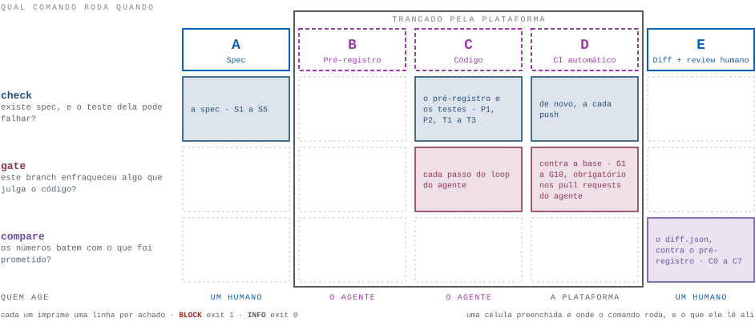

# `tools/` — os portões determinísticos do Spec-Lock-Diff

[English](README.md) · **Português (pt-BR)**

<p align="center">
  
  
  
  
</p>

Três comandos, trinta regras, um arquivo.

<p align="center">
  <picture>
    <source media="(prefers-color-scheme: dark)" srcset="../assets/commands-pt-dark.svg">
    
  </picture>
</p>

```
python tools/slp.py check   [--project-dir .] [--marts-path models/marts]
python tools/slp.py gate    --base <git ref> [--head HEAD] [--project-dir ...] [--marts-path ...]
python tools/slp.py compare <diff.json> [<diff.json> ...] [--base <git ref>] [--project-dir ...]
python tools/slp.py --version
```

Cada regra aqui impõe uma frase do [README do framework](../README.pt-br.md);
onde o framework não diz nada, estas ferramentas não fazem nada. Quando uma
regra dispara, ela nomeia o arquivo, o modelo, o que esperava e a si mesma:

```
$ python tools/slp.py gate --base main
BLOCK	models/marts/fct_orders.yml	fct_orders	test 'unique' on fct_orders.order_id exists on main but not in this PR	[G1]
slp gate: 1 block - BLOCKED
```

> **Em construção.** É a primeira implementação de referência — pequena de
> propósito, e sua para adaptar. Se você melhorar, abra um *Field report* ou um PR.

**Conteúdo**

1. [Instalação](#1-instalação)
2. [Etapas A e C — `check`](#2-etapas-a-e-c--check)
3. [Etapas C e D — `gate`](#3-etapas-c-e-d--gate)
4. [Etapa E — `compare`](#4-etapa-e--compare)
5. [O contrato do `diff.json`](#5-o-contrato-do-diffjson)
6. [Como ler uma execução](#6-como-ler-uma-execução)
7. [As regras](#7-as-regras)
8. [O que a v0 não faz](#8-o-que-a-v0-não-faz)
9. [Como contribuir](#9-como-contribuir)

---

## 1. Instalação

**Você precisa de** Python 3.9+ e git 2.20+, mais duas bibliotecas e nada além:

```bash
pip install "pyyaml" "jsonschema>=4"
```

Se você tem dbt instalado, já tem as duas. O piso do jsonschema não é enfeite —
os schemas são JSON Schema draft 2020-12 e o validador dele chegou na 4.0; na
3.x as ferramentas não caem para um draft antigo, elas não sobem. Se no seu
sistema não existe `python` puro, leia `python3` em todo `python` deste
documento.

**Copie `tools/` para o lado do seu `dbt_project.yml`** — a pasta, não o
arquivo: o `slp.py` lê os schemas do diretório ao lado dele.

Depois suba. Cada degrau abaixo fica verde sozinho e vale alguma coisa sozinho,
e nenhuma regra de um degrau que você alcançou fica mais fraca por causa dos
degraus que você ainda não alcançou. Pare onde o valor parar.

### Degrau 1 — `check`, na sua máquina

```bash
python tools/slp.py check
```

Todo modelo em `models/marts/` tem spec completa, pré-registro válido se tiver
algum, e um teste de unicidade na chave primária capaz de reprovar de verdade.
Sem CI, sem warehouse, sem git, sem dbt. É a
[seção 2](#2-etapas-a-e-c--check) inteira, e é a Etapa A com uma máquina lendo
por cima do seu ombro.

Uma regra daqui alcança um arquivo que é do degrau 3: a `S5` exige que um modelo
crítico ou incremental tenha dono no CODEOWNERS, e bloqueia enquanto não tiver.
Escreva esse arquivo cedo, ou comece por modelos `tier: standard`.

Ainda não tem um projeto seu? Tem um em
[`examples/quickstart`](../examples/quickstart/README.md) — dois marts, um
standard e um crítico, com suas specs, seus pré-registros e seus diffs — e uma
lista de coisas para quebrar de propósito e ver uma regra disparar:

```bash
python tools/slp.py check --project-dir examples/quickstart
```

### Degrau 2 — `check` e `gate` no CI, ainda sem warehouse nenhum

| Copie | Para | Depois edite |
| --- | --- | --- |
| `tools/templates/ci.yml` | `.github/workflows/ci.yml` | Nada, para começar. Defina a variável de repositório `AGENT_LOGIN` com o usuário-bot do agente, para o gate ser obrigatório nos PRs que ele abre e consultivo nos seus. |

Vinte e uma das trinta regras e o Controle 5B inteiro, por um arquivo e uma
variável. Ele instala Python e duas bibliotecas — sem adapter, sem credencial e
sem um `exit 1` sequer — então a primeira execução já fica verde. Liste `ci`
como check obrigatório.

### Degrau 3 — os caminhos que ninguém edita caladinho

| Copie | Para | Depois edite |
| --- | --- | --- |
| `tools/templates/CODEOWNERS` | `.github/CODEOWNERS` | Troque `@your-org/data-platform`; liste seus modelos incrementais e seus diretórios críticos. Ele segue a tabela de caminhos protegidos do framework linha por linha. |
| `tools/templates/AGENTS.md` | `AGENTS.md` | Mantenha a lista de caminhos protegidos idêntica à do seu CODEOWNERS. Nada no arquivo é um controle — ele conta ao agente o que as máquinas vão fazer, para o agente não gastar um PR descobrindo. |

**Ligue a proteção de branch** na `main`: exigir pull request, exigir review dos
Code Owners e bloquear force-push em toda branch — três regras do gate leem o
histórico da branch, e um histórico reescrito é um histórico que elas não
enxergam.

### Degrau 4 — os controles que não são código

Controles 1 a 4 do [README do framework](../README.pt-br.md#2-construindo-a-trava--5-controles-obrigatórios):
a identidade própria do agente, o acesso restrito aos dados, os tetos de gasto e
os perfis estatísticos no lugar das linhas. Nada em `tools/` garante esses
controles e nada aqui poderia — são permissões, monitores e máscaras, não um
script. É o degrau que faz valer a pena ler os números do degrau seguinte.

### Degrau 5 — Etapa E, o diff

| Copie | Para | Depois edite |
| --- | --- | --- |
| `tools/templates/ci-warehouse.yml` | `.github/workflows/ci-warehouse.yml` | Escreva seu adapter, sua autenticação no warehouse, seus artefatos de produção, o build amostrado, o build completo e o diff. **Seis passos saem com 1 até você escrever** — um template entregue sem edição falha fechado. |

Acrescente `build` e `diff` aos checks obrigatórios. O maior desses passos é o
próprio diff, e é a única coisa que estas ferramentas não fazem por você: a
[seção 5](#5-o-contrato-do-diffjson) é o contrato dele, e mostra uma query para
partir daí.

**Confira que roda, depois rode os testes dele** — uns trezentos e cinquenta,
alguns segundos, sem rede. Se passam, os portões da sua máquina são os portões
do CI.

```bash
python tools/slp.py --version
pip install pytest && pytest tools/tests -q
```

---

## 2. Etapas A e C — `check`

O `check` faz uma pergunta a cada modelo em `models/marts/`: ele tem uma spec
completa, um pré-registro válido se tiver algum, e um teste de unicidade na
primary key que de fato consiga falhar? Ele lê yml e uma linha de sql, nunca
chama o git e nunca toca no warehouse.

**Roda na** Etapa A, enquanto o Autor escreve a spec; na Etapa C, antes de o
agente commitar; e na Etapa D, no CI, a cada push.

```
$ python tools/slp.py check
slp check: OK (1 model in models/marts/, of 1 model read)

$ python tools/slp.py check
BLOCK	models/marts/fct_orders.yml	fct_orders	the uniqueness test on primary key [order_id] cannot fail the build: it sets where	[T1]
slp check: 1 block - BLOCKED
```

As duas saem de `tests/fixtures/check/spec_ok` e de `check/pk_test_where`; rode
você mesmo com `--project-dir`.

**Onde ele olha.** `models/marts/`, porque é ali que o framework torna a spec
obrigatória. Se os seus marts moram em outro lugar, diga, repetindo a flag por
diretório — e passe os mesmos caminhos para o `gate` e para o `compare`:

```
python tools/slp.py check --marts-path models/core --marts-path models/finance
```

- **Um caminho que não é um diretório é exit 2, não aprovação.** Uma ferramenta
  apontada para uma pasta que não existe não acha nada de errado em nada, e isso
  se lê exatamente como uma execução limpa.
- **A linha de resumo dá dois números**: quantos modelos foram *cobrados pelo
  framework* e quantos foram lidos no total. Só o primeiro é cobertura.
- **Um modelo é de marts quando o `.sql` dele mora num caminho de marts** — não
  quando o yml que o documenta mora. Um projeto com um `models/schema.yml` para
  tudo, que é o que o `dbt init` monta, é dbt comum; decidir pelo yml teria
  isentado todo modelo dele de `S1`, `T1` e `G7` enquanto o `check` imprimia `OK`.

**Um teste que não pode falhar é uma caixinha marcada.** O `T1` só aceita um
teste de unicidade capaz de reprovar o build. `enabled: false`, `severity: warn`,
ou um `where`, `error_if`, `warn_if`, `fail_calc` ou `limit` passam aconteça o
que acontecer com os dados — um `unique` com `where: "1 = 0"` não olha linha
nenhuma. O `check` diz qual desses ele encontrou.

**O que o CODEOWNERS possui.** Duas regras de aprovação não são sobre o yml: um
Parceiro aprova um modelo crítico, e modelos incrementais são listados
explicitamente porque nenhum seletor distingue um do outro. As duas degradam em
silêncio — um modelo crítico num diretório que nenhuma linha do CODEOWNERS cobre
faz merge só com a aprovação do Autor. Então o `S5` lê o `.github/CODEOWNERS`
(ou `CODEOWNERS`, ou `docs/CODEOWNERS`) do jeito que o git lê — padrões de
gitignore, a última linha que casa vence, uma linha sem dono desapropria — e
bloqueia quando o sql ou o yml de um modelo desses não tem dono. Ele não sabe
dizer se o dono é o time *certo*; sabe dizer se existe algum.

---

## 3. Etapas C e D — `gate`

O `gate` compara esta branch com o ponto de onde ela saiu e bloqueia o PR se
algo que julga o código ficou mais fraco: um teste, um unit test, uma query de
reconciliação, um pin de pacote ou a própria spec. A Regra 3 do framework é
*teste falhou = código errado*; o gate é o que faz disso mais que um desejo.

Ele pede ao git o **merge-base** de `--base` e `--head`, não a ponta da `main`,
para que uma branch que andou não pareça a sua branch removendo coisas. Um teste
é identificado pelo modelo, pela coluna, pelo nome e pelos argumentos: mover o
teste de arquivo ou renomear `tests:` para `data_tests:` não muda nada, enquanto
encolher um `accepted_values` muda tudo.

**Roda na** Etapa C, antes de o agente commitar (`--base main`), e na Etapa D, no
CI, a cada push, com as duas pontas do pull request.

```
$ python tools/slp.py gate --base main
BLOCK	models/marts/fct_orders.yml	fct_orders	the sql of this model changed on this branch and it carries no meta.pre_registration; nothing downstream has an interval to hold its numbers against, and compare will not so much as look at it	[G8]
slp gate: 1 block - BLOCKED
```

No CI, passe as duas pontas explicitamente e faça checkout do histórico
completo — três regras caminham pelos commits:

```yaml
- uses: actions/checkout@v4
  with:
    fetch-depth: 0
- run: |
    python tools/slp.py gate \
      --base ${{ github.event.pull_request.base.sha }} \
      --head ${{ github.event.pull_request.head.sha }}
```

**O pré-registro não é opcional.** O `G8` bloqueia quando o `.sql` de um modelo
de marts mudou e não há `meta.pre_registration` para segurar os números dele — ou
quando o que existe é o que a `main` já tinha. Um pré-registro pertence a um
pull request: ele fica no yml depois do merge como registro do que foi previsto,
então a próxima mudança encontra um escrito para outra mudança contra outra
produção, e um idêntico ao do merge-base conta como ausente. Ele é escopado ao
`.sql` porque o framework amarra o intervalo a escrever código; adicionar um
teste ou documentar uma coluna não pede intervalo.

**O que o yml não mostra.** O dbt resolve macros do projeto antes das próprias,
então um `` em `tests/generic/` ou `macros/` substitui o
embutido em todo lugar onde ele é declarado, e um teste singular em `tests/`
carrega a `severity` dentro do próprio `{{ config() }}` — enfraquecimentos que
nenhum yml de modelo registra. Por isso o `G9` bloqueia qualquer mudança num
caminho protegido (`.github/`, `.pre-commit-config.yaml`, `CODEOWNERS`,
`AGENTS.md`, `dbt_project.yml`, `macros/`, `models/semantic/`, `docs/profile/`,
`tools/`) e qualquer arquivo adicionado em `tests/generic/`; o `G10` lê o
`config()` de todo teste singular que a branch adiciona. Caminhos com regra
própria continuam com ela, para uma mudança ser um achado só: os arquivos de
pacote são `G6`, `analyses/reconciliation_*` é `G5`, um arquivo de teste que já
existia é `G1`.

**Quem ele bloqueia.** Dentro de um PR o gate julga todo commit, tenha sido quem
tiver escrito — autor de commit é texto que qualquer um escreve. *Quais* PRs ele
bloqueia é decidido por quem os abriu, uma identidade que a plataforma
autentica: o `templates/ci.yml` exige o gate nos PRs abertos pelo `AGENT_LOGIN` e
o roda em modo consultivo nos dos outros, onde os achados vão para o resumo do
job e o CODEOWNERS decide. Sem a variável, ele é obrigatório em todos — uma
variável que ninguém definiu não pode tornar um portão opcional. Assim, no PR de
um agente ninguém enfraquece um teste, nem o agente nem um humano; um humano que
precise mexer num teste, numa macro, num pin ou no CI faz isso **antes de o
agente começar**, ou num pull request próprio.

---

## 4. Etapa E — `compare`

O `compare` lê os números que o seu diff mediu e segura cada um contra o
intervalo que o pré-registro declarou antes de qualquer linha de código: delta de
linhas, primary keys removidas, colunas alteradas, cada métrica e — para modelos
críticos — a reconciliação contra a tolerância dela. Ele não produz o diff e não
roda a query de reconciliação; essas coisas tocam o warehouse.

**Roda na** Etapa E, uma vez por pull request, depois do build completo.

Duas flags decidem se ele consegue fazer o trabalho:

- **Entregue todos os diffs que o build produziu, numa chamada só** —
  `compare diff/*.json`, não uma chamada por arquivo. O `C7` bloqueia um modelo
  pré-registrado cujos números nunca apareceram, e uma regra sobre o que está
  *faltando* só enxerga o que recebeu.
- **Passe `--base <git ref>`**, a branch que o PR mira, como o
  `templates/ci-warehouse.yml` faz. Aí um pré-registro ainda idêntico ao do
  merge-base é a previsão da `main`, não deste PR: o `C7` não cobra o diff dele, e um diff
  medido contra ele é recusado (`C0`). Sem `--base`, todo pré-registro do
  projeto conta como deste PR — mais rígido, nunca mais frouxo, mas uma execução
  local pode bloquear por um modelo em que você nem tocou.

```
$ python tools/slp.py compare diff.json
INFO	diff.json	fct_orders	declared as a data_change, because: include status partially_shipped, previously excluded incorrectly	[I2]
INFO	diff.json	fct_orders	row_delta 8400, declared 0..12000 (a band 12000 wide)	[I2]
INFO	diff.json	fct_orders	removed_pks 0, declared at most 0	[I2]
INFO	diff.json	fct_orders	metric gross_revenue moved 0.42 percent, declared 0.0..0.8 (a band 0.8 wide)	[I2]
INFO	diff.json	fct_orders	altered columns measured [gross_revenue], declared [gross_revenue]	[I2]
INFO	diff.json	fct_orders	this diff declares no window; README §3 Stage E step 2 asks for a closed event_time window identical on both sides, and nothing here can check that	[I2]
slp compare: 6 infos - OK
```

Nada bloqueou, e ainda assim a `I2` imprimiu cada número. É exatamente esse o
ponto dela: a Etapa E pergunta ao Autor *"o pré-registro é estreito o suficiente
para conseguir falhar?"*, e um `row_delta` de 8.400 dentro de uma faixa de 12.000
é uma revisão diferente dos mesmos 8.400 dentro de uma faixa de 200. Então o
`compare` imprime o motivo declarado, cada número, a faixa dele e a largura dessa
faixa. A última linha é a ferramenta nomeando uma promessa que ela não consegue
cumprir por você — nada aqui verifica se a janela foi fechada e idêntica dos dois
lados.

---

## 5. O contrato do `diff.json`

Um arquivo por modelo, escrito por quem quer que meça o seu diff. As chaves
espelham o pré-registro de propósito, para a comparação ser chave a chave. O
`compare` recusa chaves que não conhece, e é isso que impede um typo de ser lido
como "nada mudou".

| Chave | Tipo | Obrigatória | Significado |
| --- | --- | --- | --- |
| `model` | string | sim | o modelo dbt sobre o qual estes números foram medidos |
| `row_delta` | inteiro | sim | linhas no build do PR menos linhas na produção, dentro da janela |
| `removed_pks` | inteiro ≥ 0 | sim | primary keys presentes na produção e ausentes no build do PR |
| `altered_columns` | array de strings | sim | colunas com ao menos uma linha casada por PK cujo valor difere |
| `metrics` | objeto de `{delta_pct: número ou null, value: número}` | sim (pode ser `{}`) | uma medição por métrica; `value` quando a produção não tem esse modelo |
| `reconciliation` | `{model_value, external_value}` | não | modelos críticos |
| `window` | `{column, start, end}` | não | impressa pelo `compare` para quem revisa |
| `extra` | objeto | não | qualquer outra coisa que você queira carregar; ignorada |

**A unidade e o sinal de `delta_pct`.** Pontos *percentuais*, como número puro,
calculado como `(pr − prod) / prod × 100`.

> A produção soma 1.000.000,00 de `gross_revenue` na janela. O build do PR soma
> 1.008.000,00. Então `delta_pct` é
> `(1008000 − 1000000) / 1000000 × 100 = 0.8` — o número **0.8**, não 0.008 e
> não 80. Um pré-registro de `{min: 0.0, max: 0.8}` aceita, no limite. Se o
> build do PR somar *menos* que a produção, o número é negativo. Quando a
> produção é 0 a porcentagem não existe: escreva `null`, e o `compare` bloqueia,
> porque um número que ninguém consegue avaliar não é um número que alguém
> aprovou.

**Um modelo que a produção não tem** — um agente construindo um mart novo a
partir de uma spec — não tem lado de produção e, portanto, não tem porcentagem a
prever. Ali o pré-registro declara `value: {min, max}` no lugar, escrito em volta
do número que está em `external_validation`, e o diff carrega `value`, o valor da
métrica no build do PR dentro da janela. O `row_delta` passa a ser a própria
contagem de linhas, e `altered_columns` é `[]` dos dois lados.

**De onde vêm os números.** De qualquer coisa determinística: Recce,
`dbt-audit-helper` em modo summary, ou o seu próprio SQL. A janela precisa ser
fechada e idêntica dos dois lados — se a produção tem dados até ontem e o build
do PR até hoje, "hoje" aparece como diferença falsa. Um ponto de partida, adapte
à vontade:

```sql
-- YOU: your schemas, your model, your window, your metrics.
with prod as (
    select * from analytics.fct_orders
    where order_date >= date '2025-01-01' and order_date < date '2025-02-01'
),
pr as (
    select * from ci_pr_42_full.fct_orders
    where order_date >= date '2025-01-01' and order_date < date '2025-02-01'
),
matched as (
    select
        prod.order_id       as prod_key,
        pr.order_id         as pr_key,
        prod.gross_revenue  as prod_gross_revenue,
        pr.gross_revenue    as pr_gross_revenue
    from prod
    left join pr on prod.order_id = pr.order_id   -- the spec's primary_key
)
select
    (select count(*) from pr) - (select count(*) from prod)         as row_delta,
    sum(case when pr_key is null then 1 else 0 end)                 as removed_pks,
    sum(case when pr_key is not null
              and prod_gross_revenue is distinct from pr_gross_revenue
             then 1 else 0 end)                                     as gross_revenue_changed,
    100.0 * ((select sum(gross_revenue) from pr)
             - (select sum(gross_revenue) from prod))
          / nullif((select sum(gross_revenue) from prod), 0)         as gross_revenue_delta_pct
from matched
```

Uma linha na saída, um `diff.json` na entrada: `gross_revenue` entra em
`altered_columns` quando `gross_revenue_changed > 0`, e
`gross_revenue_delta_pct` — que o `nullif` já transforma em `null` quando a
produção é 0 — vai para `metrics.gross_revenue.delta_pct`. Para uma primary key
de várias colunas, junte por todas. Para um modelo crítico, acrescente os dois
números da sua query de reconciliação como `reconciliation`; uma linha de
`metric, model_value, external_value` é o formato recomendado, legível por um
humano e por quem escreve o JSON.

---

## 6. Como ler uma execução

Uma linha por achado, separada por tabulação, e depois uma linha de resumo. Tudo
no stdout; erros que param a ferramenta vão para o stderr.

```
BLOCK	models/marts/fct_orders.yml	fct_orders	test 'unique' on fct_orders.order_id exists on main but not in this PR	[G1]
INFO	models/marts/fct_orders.yml	fct_orders	pre-registration was modified 1 time after it was first written	[I1]
slp gate: 1 block, 1 info - BLOCKED
```

| Severidade | Significado |
| --- | --- |
| `BLOCK` | Tem coisa errada. Faz o código de saída ser 1. |
| `INFO` | Algo que quem revisa precisa ver. Nunca muda o código de saída. |

| Código | Significado | O que o CI faz |
| --- | --- | --- |
| 0 | Nada a relatar | passa |
| 1 | Pelo menos um `BLOCK` | falha |
| 2 | A ferramenta não conseguiu fazer o trabalho dela: arquivo que não abre, yml que não parseia, argumento errado, não é um repositório git | falha |

**O código 2 é falha, nunca aprovação.** O que não pode ser lido não pode ser
aprovado; uma aprovação silenciosa é exatamente a falha que este framework existe
para impedir.

**Três perguntas, nesta ordem.**

1. **Saiu com 2?** Então nada foi julgado. Conserte isso primeiro — um exit 2 não
   diz nada sobre o código.
2. **Tem algum `BLOCK`?** Cada um nomeia o que foi medido e o que foi prometido,
   e termina num id de regra que você procura na [seção 7](#7-as-regras). Um
   bloqueio do `gate` quase nunca é coisa para contornar: é um teste que ficou
   mais fraco, e a Regra 3 diz que quem muda é o código.
3. **Depois leia as linhas `INFO`.** Elas nunca mudam o código de saída, e é
   justamente por isso que são fáceis de pular e valem não pular. É por isso que
   os dois templates de workflow jogam no resumo do job o que executam.

**Uma execução que não bloqueia nada não é uma execução que não achou nada para
olhar.** `slp check: OK (3 models in models/marts/, of 40 models read)` é uma
afirmação de cobertura — leia o primeiro número. Um verde que quer dizer *"eu não
olhei"* é a falha que o framework existe para impedir.

Os achados são ordenados por arquivo, depois modelo, depois o que bloqueia antes
do que só informa, depois id da regra; empates mantêm a ordem em que a regra os
produziu. Os mesmos arquivos na entrada dão as mesmas linhas na saída, em
qualquer máquina.

**Onde as ferramentas procuram cada coisa.** O dbt 1.10 moveu `meta` para dentro
de `config`, então as duas grafias são lidas. As duas presentes para a mesma
coisa é exit 2, "ambiguous: defined twice" — a ferramenta não adivinha qual você
quis dizer.

| Coisa | Clássico | dbt 1.10+ |
| --- | --- | --- |
| spec | `models[].meta.spec` | `models[].config.meta.spec` |
| pré-registro | `models[].meta.pre_registration` | `models[].config.meta.pre_registration` |
| flag de sensível | `columns[].meta.sensitive` | `columns[].config.meta.sensitive` |
| testes de dados | `tests:` | `data_tests:` |
| argumentos de teste | no teste: `- accepted_values: {values: [...]}` | sob `arguments:` |

Mover os argumentos de um teste para `arguments:` não é "mudou os argumentos".
`tags`, `meta`, `description`, `name`, `store_failures` e as outras chaves que
não dizem nem o que um teste afirma nem se ele pode falhar são lidas e nunca
comparadas, então adicionar uma tag a um teste também não é achado.

---

## 7. As regras

Uma linha por regra: o que ela bloqueia, onde o framework pede isso, e as duas
fixtures a que os meta-testes a prendem — uma em que ela dispara, outra em que
fica calada. O **M2** falha se uma regra não tem linha, ou se uma linha aponta
para uma fixture que não faz o que a linha diz.

Marcações: `§1 P`*n* um princípio, `§2 C`*n* um controle, `§3 C R`*n* uma regra do
agente, `§3 A`–`§3 E` uma etapa. **Cinco regras só informam** e nunca mudam o
código de saída — `I1`, `I2`, `I3`, `I4` e `C5`. O framework pede que o que elas
dizem esteja *visível*, não que pare o PR, e o **M2** confere isso contra o
código-fonte, para que nenhuma delas ganhe um `BLOCK` em silêncio.

### `check`

| O que bloqueia | Regra | Dispara | Calada |
| --- | --- | --- | --- |
| Um modelo de marts sem `meta.spec` — §3 A | `S1` | `check/marts_no_spec` | `check/spec_ok` |
| Uma spec sem um campo obrigatório, ou com valor inválido — §3 A | `S2` | `check/spec_invalid_tier` | `check/spec_ok` |
| Uma spec que nomeia coluna ou query de reconciliação que não existe — §3 A | `S3` | `check/sensitive_mismatch` | `check/spec_ok` |
| Um `.sql` num caminho de marts que nenhum yml declara — §3 A | `S4` | `check/sql_without_yml` | `check/spec_ok` |
| Um modelo crítico ou incremental que o CODEOWNERS não possui — §3 E, §2 C5A | `S5` | `check/critical_unowned` | `check/critical_owned` |
| Um pré-registro com intervalo aberto ou campo faltando — §3 B, §3 C R6 | `P1` | `check/prereg_open_interval` | `check/prereg_ok` |
| Um `min` acima do `max`, ou métricas que não são as da spec — §3 B | `P2` | `check/prereg_min_gt_max` | `check/prereg_ok` |
| Nenhum teste de unicidade na `primary_key` da spec, ou um que não pode falhar — §3 C R2 | `T1` | `check/pk_single_missing` | `check/pk_single_unique` |

### `gate`

| O que bloqueia | Regra | Dispara | Calada |
| --- | --- | --- | --- |
| Um teste removido, desabilitado, ou com os argumentos alterados — §2 C5B | `G1` | `gate/G1_removed_unique` | `gate/G1_ok_test_added` |
| Um `where` adicionado a um teste que já existia — §2 C5B | `G2` | `gate/G2_where_added` | `gate/G2_ok_where_removed` |
| Uma severity rebaixada, ou um teste que já nasce sem poder falhar — §2 C5B | `G3` | `gate/G3_error_to_warn` | `gate/G3_ok_warn_to_error` |
| O `given` ou o `expect` de um unit test existente alterado — §2 C5B | `G4` | `gate/G4_expect_changed` | `gate/G4_ok_new_unit_test` |
| `analyses/reconciliation_*` alterado junto com o próprio modelo — §2 C5B | `G5` | `gate/G5_recon_and_sql_changed` | `gate/G5_ok_recon_only` |
| Um pin de pacote alterado — §2 C5B | `G6` | `gate/G6_version_bumped` | `gate/G6_ok_untouched` |
| Uma `meta.spec` editada depois de escrita pela primeira vez — §1 P1, §3 A | `G7` | `gate/G7_existing_spec_edited` | `gate/G7_ok_new_spec_untouched` |
| Um `.sql` alterado sem pré-registro, ou com o da `main` — §3 B | `G8` | `gate/G8_sql_changed_no_prereg` | `gate/G8_ok_prereg_present` |
| Um caminho protegido alterado, ou um teste genérico adicionado — §2 C5A, §3 C R8 | `G9` | `gate/G9_generic_test_added` | `gate/G9_ok_untouched` |
| Um teste singular adicionado em `tests/` que não pode falhar — §2 C5B | `G10` | `gate/G10_singular_born_warn` | `gate/G10_ok_singular_plain` |
| Informa: quantas vezes o pré-registro mudou depois de escrito — §3 B | `I1` | `gate/I1_two_edits` | `gate/I1_ok_written_once` |
| Informa: um `where` num teste que esta branch adiciona — §2 C5B | `I3` | `gate/I3_new_test_with_where` | `gate/I3_ok_new_test_plain` |
| Informa: o commit que escreveu primeiro uma spec nova nesta branch — §3 A | `I4` | `gate/I4_spec_first_written_on_branch` | `gate/I4_ok_spec_from_main` |

### `compare`

| O que bloqueia | Regra | Dispara | Calada |
| --- | --- | --- | --- |
| Um diff ou pré-registro que ele não consegue ler, ou um que ainda é da `main` — §3 E3 | `C0` | `compare/C0_no_prereg` | `compare/C1_inside` |
| `row_delta` fora do intervalo declarado — §3 E3 | `C1` | `compare/C1_row_delta_above_max` | `compare/C1_inside` |
| Mais `removed_pks` do que foi declarado — §3 E3 | `C2` | `compare/C2_removed_pks_over` | `compare/C1_inside` |
| Uma coluna que difere e não está em `altered_columns` — §3 E3 | `C3` | `compare/C3_undeclared_column` | `compare/C1_inside` |
| Uma métrica fora do intervalo, inavaliável, ou não declarada — §3 E3 | `C4` | `compare/C4_metric_outside` | `compare/C1_inside` |
| Informa: uma `refactoring` em que algum número mexeu — §3 E3 | `C5` | `compare/C5_refactoring_nonzero` | `compare/C1_inside` |
| Uma reconciliação acima da tolerância, ou ausente num modelo crítico — §3 E4 | `C6` | `compare/C6_over` | `compare/C6_ok_within` |
| Um modelo pré-registrado cujo diff nunca apareceu — §3 E3 | `C7` | `compare/C7_prereg_without_diff` | `compare/C1_inside` |
| Informa: cada número, a faixa declarada para ele e a largura dessa faixa — §3 E5 | `I2` | `compare/C1_inside` | `compare/C0_no_prereg` |

---

## 8. O que a v0 não faz

Tudo isto faz parte do framework e **não** é imposto aqui. Saber o que é o quê é
o ponto da lista; o [CHANGELOG.md](CHANGELOG.md) conta cada história.

**Onde aprovado não quer dizer aprovado.** Leia este grupo primeiro: são as
maneiras de um verde ser um verde sobre nada.

- O `--marts-path` ainda precisa dizer a mesma coisa em três comandos e dois
  workflows, e nada confere que diz. Um caminho que não existe agora é exit 2
  nos três, e `./models/marts` nomeia o mesmo diretório que `models/marts` — mas
  um caminho que existe e é o errado continua estreitando o que é conferido sem
  avisar. Mantenha a flag num lugar só e copie.
- Um projeto dbt que não está na raiz do repositório git faz o `gate` sair com 2
  em toda leitura, e o `--project-dir` não salva.
- Um schema yml escrito com jinja é ilegível para um parser YAML puro — exit 2
  para a execução inteira até o arquivo mudar. Mantenha yml gerado fora dos
  caminhos de marts. O mesmo vale para um yml que não parseia em qualquer commit
  da caminhada, pela vida inteira da branch.
- O `compare` sem `--base` conta todo pré-registro como deste PR, então uma
  execução local pode bloquear por um modelo em que você nem tocou.
- `G7`, `I1` e `I4` leem o histórico da branch e não enxergam um que foi
  reescrito. Bloqueie force-push, preserve os commits e leia a `I1` como piso;
  sem isso, trate as três como consultivas.

**O que os portões não conseguem ver.**

- Testes em sources, seeds e snapshots: o `gate` lê só `models:` e `unit_tests:`,
  então um `not_null` removido de uma source imprime `OK`. Modelos em Python
  também são invisíveis — `S4`, `G8` e o critério de marts olham para o `.sql`.
- Um modelo de marts rebaixado para fora dos marts com `git mv`, ou desligado com
  `config: {enabled: false}`, escapa de toda regra de marts. O mesmo vale para
  uma spec **apagada** de vez: o `G7` dispara quando uma spec *muda*, e o `check`
  pega só o sintoma (`S1`), que se lê como um modelo que nunca teve spec.
- Uma mudança feita só no yml que ainda assim mexe nos números — uma
  materialização, um `config` — porque o `G8` é escopado ao `.sql`. E a *ordem*
  da Etapa B: o pré-registro é conferido como presente no fim da branch, não como
  escrito antes do código ao longo dela.
- Se cada known_edge da spec virou unit test, e se uma tolerância ou uma âncora
  conseguem falhar: `reconciliation_tolerance: "999%"` e
  `external_validation: "TODO"` satisfazem o schema.
- O `compare` revalida o pré-registro e não a spec, então um `tier` escrito
  errado pula o `C6`; o `check` pega isso na mesma execução de CI.
- O `T1` recusa um teste de unicidade *mais forte* que a primary key, e o teste
  de contagem mínima da Regra 2, cujo nome varia por time. Adicione a forma que
  você usa em `ACCEPTED_PK_TESTS`.
- O que uma mudança no `dbt_project.yml` ou numa macro *faz*. O `G9` bloqueia a
  mudança; ler o que ela faz é trabalho do CODEOWNERS.

**Nunca foi trabalho de um script.**

- A tranca em si — roles no warehouse, mascaramento, tetos de gasto, perfis
  estatísticos. `REVOKE USAGE ON SCHEMA raw` é o controle; Python nenhum
  substitui.
- Produzir o diff, rodar a query de reconciliação e derrubar os schemas
  `ci_pr_<n>_full`: tudo isso lê o warehouse.
- Detectar dado real em fixtures. Estas ferramentas conferem só as próprias
  (**M6**); no seu repositório use gitleaks, como a Etapa D descreve. O hook
  `PreToolUse` que recusa escrita em caminhos protegidos também é seu e opcional.
- Julgar linguagem natural — se um grão é *bom*, se um motivo justifica um
  intervalo. Princípio 3: um LLM nunca é o juiz final. Essas são as três leituras
  do humano na Etapa E.

---

## 9. Como contribuir

| Caminho | O que é |
| --- | --- |
| `slp.py` | A ferramenta inteira: três comandos, todas as regras, um arquivo que se lê de uma sentada. |
| `schemas/` | O que uma spec, um pré-registro e um `diff.json` precisam ser. |
| `templates/` | CODEOWNERS, AGENTS.md e os dois workflows de CI, prontos para copiar. |
| `tests/` | A suíte, e `tests/fixtures/` — cada caso como arquivos de verdade, uma pasta por caso com um `README.txt`. |
| `../examples/` | Um projeto em que os portões passam, e um passo a passo de um em que eles não passam. Os READMEs de lá imprimem saída de verdade, e o `tests/test_examples.py` roda os comandos e confere. |

- **Uma regra por pull request.** Uma regra é uma função, uma docstring que
  começa pela frase do framework que ela impõe, um id, uma fixture que bloqueia,
  uma que passa e uma linha na [seção 7](#7-as-regras). Os meta-testes falham se
  você esquecer uma das três últimas.
- **README do framework primeiro.** Estas ferramentas só podem impor algo que o
  framework diz. Se a sua regra exige mudar o framework, abra uma issue de
  *Framework improvement* e mude lá primeiro. Sem frase, sem regra.
- **Fixtures são sintéticas.** Só dado inventado; e-mails terminam em
  `@example.com` e números de documento inventados precisam falhar no próprio
  dígito verificador (**M6**).
- **As duas línguas.** `tools/README.md` e `tools/README.pt-br.md` são o mesmo
  documento. Mudou a substância de um, mude o outro — ou diga no pull request que
  não conseguiu.
- **Um arquivo.** Toda a lógica mora no `slp.py`, e o **M8** limita três coisas
  separadamente: a maquinaria compartilhada de que toda regra depende, qualquer
  regra sozinha, e o arquivo inteiro. Ele conta só as linhas que precisam ser
  *entendidas* — código, sem linhas em branco, comentários e docstrings — porque,
  sob um limite que conta prosa, o jeito mais barato de comprar espaço é apagar a
  explicação que torna o arquivo legível.

Para exigir um campo novo na spec, comece pelo `schemas/spec.schema.json` e
escreva a `description` dele como um requisito — essa descrição é a frase que a
ferramenta imprime. Regras entre campos ("esta coluna precisa existir") vão para
o `check_spec_consistency`.

Veja o [CONTRIBUTING.md](../CONTRIBUTING.md), os templates de issue em
`.github/ISSUE_TEMPLATE/` e o [CHANGELOG.md](CHANGELOG.md) para saber por que
cada regra passou a existir.
